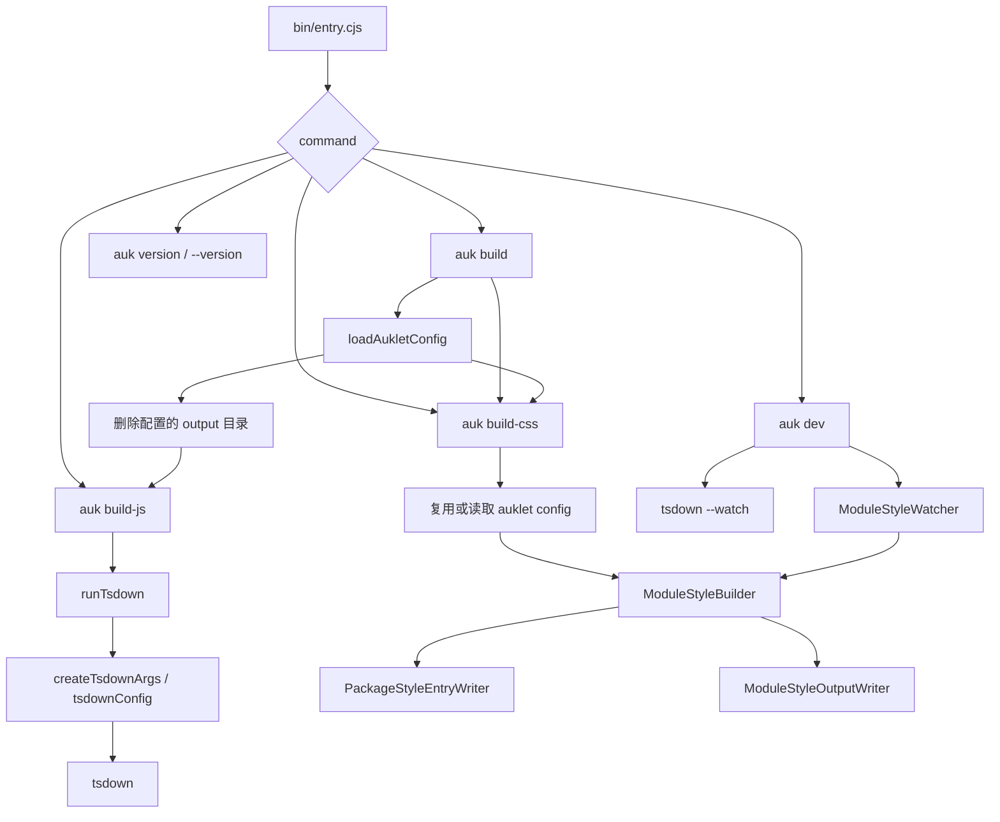
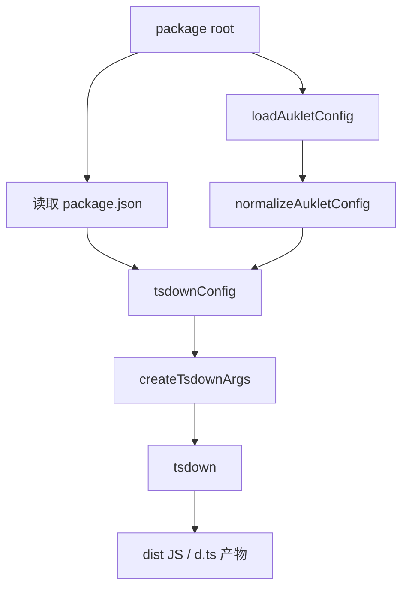
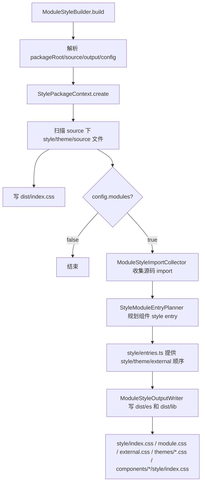
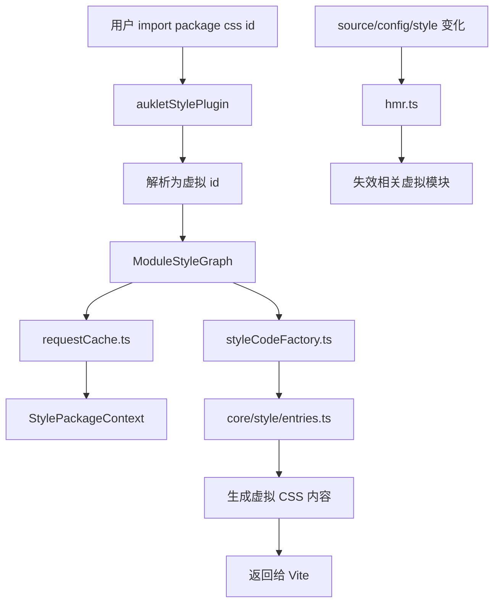

# 贡献者指南

本文档面向后续维护者和协作 AI，用来说明 auklet 当前的代码架构、核心模块职责和构建链路。修改实现前，建议先读本文档和 `TESTING.md`。

## 项目定位

auklet 是一个面向 TypeScript 包的构建工具，主要提供两部分能力：

- JavaScript/TypeScript 构建：基于 `tsdown` 生成 bundle、global、module 等产物。
- Style 构建：为组件库生成包级 CSS、模块 CSS、主题 CSS、external CSS，以及 Vite dev 环境下的虚拟 CSS 入口。

仓库本身是单包项目，`examples/` 下放真实项目形态的 demo，用于调试和测试 monorepo 场景。

## 命名约定

代码内部优先使用 `Style` 表达样式构建语义，例如 `ModuleStyleBuilder`、`ModuleStyleGraph`、`PackageStyleEntryWriter`。这样即使未来支持 Less 等其他样式语言，核心抽象也不需要大规模改名。

`css` 只保留在确实面向 CSS 产物或兼容外部接口的地方：

- 目录名：`src/css/`，表示当前模块仍然处理 CSS 产物。
- CLI 命令：`auk build-css`，保持用户命令直观。
- 文件名和 import id：`style.css`、`module.css`、`external.css`、`auklet-css:*`。
- 日志前缀：`[auklet:css]`。

## 根目录结构

```text
.
├── bin/                  # CLI 入口，发布后由 auk / auklet 命令调用
├── src/                  # 工具源码
├── examples/             # 真实项目 demo 和 examples 级测试
├── TESTING.md            # 测试架构和测试编写规范
├── README.md             # 用户使用文档
├── package.json          # 包信息、命令、exports/imports
└── tsconfig.json         # 当前包 TypeScript 配置
```

## 源码模块

```text
src/
├── index.ts              # 对外公开 API 汇总
├── types.ts              # 用户配置、内部配置、构建上下文类型
├── config.ts             # 默认配置和配置 normalize
├── configLoader.ts       # 加载 auklet.config.ts
├── utils.ts              # 通用路径和文件工具
├── build/                # JavaScript 构建链路
└── css/                  # Style 构建链路
```

### 配置模块

- `types.ts` 定义 `AukletConfig`、`NormalizedAukletConfig`、`PackageBuildOptions`、`ModuleStyleBuildConfig` 等类型。
- `config.ts` 定义默认值，并把用户配置 normalize 成内部稳定结构。
- `configLoader.ts` 负责从包根目录加载 `auklet.config.ts`，支持 TypeScript 配置文件和 cache bust。

配置读取原则：

- 对外 API 使用 `AukletConfig`。
- 内部核心模块尽量使用 `NormalizedAukletConfig`。
- 默认值集中放在 `config.ts`，不要在多个模块里重复写默认配置。

### JavaScript 构建模块

```text
src/build/
├── runTsdown.ts          # CLI/API 调用 tsdown 的入口
└── tsdownConfig.ts       # 根据 auklet 配置和 package.json 生成 tsdown 参数
```

`runTsdown` 是执行层，负责拼命令、调用 tsdown。`tsdownConfig` 是配置翻译层，负责把 auklet 的 `build` 配置转换成 tsdown 需要的格式。

### Style 核心模块

```text
src/css/core/
├── stylePackageContext.ts        # 收集当前包 style 构建上下文
├── styleProcessor.ts             # 读取、合并、展开 style 内容
├── workspaceStyleResolver.ts     # 解析 workspace/package/node_modules style 依赖
├── styleImports/                 # 从 TSX import/re-export 推导 style 依赖
│   ├── collector.ts              # 根据 source reference 和配置生成组件 style import
│   └── sourceReference.ts        # 解析 TSX import/re-export 语法
├── styleModuleEntryPlanner.ts    # 规划组件级 style 入口
└── style/
    ├── dependencies.ts           # 从配置读取 global/theme/external 依赖
    ├── entries.ts                # package/theme/external/component 入口语义
    ├── files.ts                  # style 文件扫描
    └── specifier.ts              # package style specifier 解析/生成
```

重点模块说明：

- `StylePackageContext`：把包根目录、source/output、主题文件、样式文件、resolver、processor 等聚合起来，是 production 和 dev 两边的共享上下文。
- `StyleProcessor`：负责 CSS 内容层面的处理，例如读取文件、展开 `@import`、合并 PostCSS root。
- `WorkspaceStyleResolver`：负责把配置里的 style 依赖解析到真实文件或输出路径，处理 workspace 包和外部包差异。
- `styleImports/collector.ts`：只扫描 `.tsx` 组件源码，根据 import / named re-export 和 `styles.dependencies.*.components` 推导组件级 style import。`.ts` 文件不会参与 CSS auto import；`export * from '...'` 不支持，因为无法可靠推断组件名。
- `StyleModuleEntryPlanner`：根据源码目录和 import 收集结果，生成组件级 style entry plan。
- `style/entries.ts`：环境无关的 style graph 入口，统一暴露 package、theme、external、component 的入口语义。Production writer 和 Vite/dev renderer 都消费它。

### Style production 模块

```text
src/css/production/
├── builder.ts                       # CSS 构建入口
├── packageEntryWriter.ts           # 写入包级 dist/index.css
├── moduleOutputWriter.ts            # 编排 dist/es 和 dist/lib 下的模块化 CSS 产物
└── format/
    ├── sourceWriter.ts              # 复制源码 style 文件
    ├── entryWriter.ts               # 写入 style/index.css
    ├── moduleWriter.ts              # 写入 style/module.css
    ├── externalWriter.ts            # 写入 style/external.css
    ├── themeWriter.ts               # 写入 style/themes 和 themes 入口
    ├── componentWriter.ts           # 写入组件级 style/index.css
    └── shared.ts                    # format writer 共享类型和路径 helper
```

- `ModuleStyleBuilder` 负责组织构建流程：解析上下文、判断是否需要生成模块产物、调用包级入口 writer 和模块化输出 writer、输出日志。
- `PackageStyleEntryWriter` 只负责包级 `dist/index.css` 聚合产物。
- `ModuleStyleOutputWriter` 只负责编排 `dist/es`、`dist/lib` 下的输出流程，具体文件写入由 `format/` 下的原子 writer 完成。

production 文件职责：

- `builder.ts`：production CSS 构建入口。负责创建 build context、创建 `StylePackageContext`、决定是否执行 modules 输出、汇总日志。
- `packageEntryWriter.ts`：写包级入口 `dist/index.css`。这个文件会把本包主题、全局 style 依赖和本包源码 style 聚合成一个真实 CSS 文件。
- `moduleOutputWriter.ts`：写 modules 模式下的 format 产物编排器。它遍历 `es`、`lib` 等输出格式，并按顺序调用 `format/` 下的原子 writer。
- `format/sourceWriter.ts`：复制源码 style 文件到当前 format 输出目录，保持组件源码 style 文件能被组件级入口引用。
- `format/entryWriter.ts`：写当前 format 的 style 总入口，例如 `dist/es/style/index.css`。入口组合顺序来自 `style/entries.ts`。
- `format/moduleWriter.ts`：写当前包自身模块样式集合，例如 `dist/es/style/module.css`。
- `format/externalWriter.ts`：写外部 style 入口，例如 `dist/es/style/external.css`。
- `format/themeWriter.ts`：写主题相关产物，包括 `dist/es/style/themes/*.css` 和 `dist/es/themes/*.css`。
- `format/componentWriter.ts`：写组件级 style 入口，例如 `dist/es/components/Button/style/index.css`。
- `format/shared.ts`：放 format writer 共享类型、空入口注释和相对 import 路径 helper。

production 模块不应该重复实现 dev graph 的入口语义；入口组合顺序应优先来自 `style/entries.ts`。

### Style dev/Vite 模块

```text
src/css/vite/
├── vitePlugin.ts        # Vite 插件入口
├── hmr.ts               # style 相关 HMR 判断和更新
└── moduleGraph/         # Vite/dev 虚拟 CSS 图
    ├── graph.ts         # graph facade、watch 边界和 workspace 包发现
    ├── styleCodeFactory.ts
    ├── requestCache.ts
    ├── devDependency.ts
    ├── loadResult.ts
    ├── styleId.ts
    └── types.ts
```

Vite 插件负责把 package CSS import 转成虚拟模块，并调用 `moduleGraph/` 生成 CSS 内容。HMR 模块负责判断源码、配置、style 文件变化后哪些虚拟 CSS 模块需要失效。

- `moduleGraph/graph.ts`：Vite/dev 模式下的 graph facade，根据虚拟 CSS id 创建请求缓存并分发给 CSS 生成器。
- `moduleGraph/styleCodeFactory.ts`：根据 `style/entries.ts` 生成 dev 虚拟 CSS 内容，并递归解析 workspace style 依赖。
- `moduleGraph/requestCache.ts`：缓存一次 graph 请求中的 package context，避免同一次请求重复加载和扫描。
- `moduleGraph/devDependency.ts`：把 dev 虚拟 CSS 里的第三方 CSS dependency 按声明它的 package root 解析成 Vite `/@fs/...` 路径，避免虚拟模块丢失 node_modules 解析上下文。

### Watch 模块

```text
src/css/watch/
└── watcher.ts
```

`ModuleStyleWatcher` 用于 `auk build-css --watch` 和 `auk dev`。它监听包内 source/config/style 变化，并 debounce 调用 `ModuleStyleBuilder`。

## CLI 链路

CLI 入口是 `bin/entry.cjs`，发布后暴露为 `auk` 和 `auklet`。



## JavaScript 构建链路



关键规则：

- `build.target` 默认是 `es2020`。
- `build.platform` 默认是 `neutral`。
- `build.tsconfig` 默认从包根目录向上查找最近的 `tsconfig.json`。
- `dependencies`、`peerDependencies` 和 `build.externals` 会作为 external 的来源。
- `build.alias` 会透传给 tsdown `alias`，bundle 和 module 产物都生效。
- `build.globals` 会合并进 IIFE 产物的 `output.globals`，并覆盖根据 external 包名自动推导的全局变量名。
- `build.configureTsdown` 是最终 tsdown config 钩子；`kind` 只区分 `bundle` 和 `module`，分别对应包级 bundle 产物和 `modules: true` 下的 unbundled 产物。
- `modules: true` 时会生成 `dist/es` 和 `dist/lib` 这类模块产物；CSS 组件级产物也跟随这个行为。

## CSS production 构建链路



产物语义：

- `dist/index.css`：包级聚合 CSS，面向直接引用包样式的场景。
- `dist/{es,lib}/style/index.css`：当前 format 的 style 总入口。
- `dist/{es,lib}/style/module.css`：当前包自身组件样式集合。
- `dist/{es,lib}/style/external.css`：external style 入口。
- `dist/{es,lib}/themes/*.css`：主题入口，包含主题依赖和当前主题文件。
- `dist/{es,lib}/components/*/style/index.css`：组件级 style 入口。

## CSS dev/Vite 链路



dev 链路不写真实产物，而是生成虚拟 CSS 内容。它和 production writer 共享 `core/style/entries.ts`，确保以下语义一致：

- style 总入口包含哪些部分，以及顺序。
- theme 入口是否包含主题依赖，以及当前主题内容。
- external 入口如何表达外部 style 依赖。

dev 虚拟 CSS 会保留 workspace style 依赖的虚拟递归语义；非 workspace 的第三方 CSS dependency 会用声明它的 package root 解析，并输出为 Vite `/@fs/...` import，避免 PostCSS/Vite 从消费项目或虚拟模块上下文解析失败。

## Examples

```text
examples/
├── components/     # 组件库 monorepo demo
├── libs/           # 纯 lib monorepo demo
└── __tests__/      # examples 构建产物测试
```

examples 用于覆盖真实使用场景：

- `components`：包含 theme、ui、dashboard 等包，覆盖组件库、主题依赖、包间组件依赖。
- `libs`：覆盖没有 CSS 的纯 TypeScript lib 构建。
- `examples/__tests__`：检查 examples 构建后的 JS 产物、CSS 产物和目录结构。

根目录 `pnpm build:examples` 会构建 examples 下的包，`pnpm test:examples` 会先构建再运行 examples 测试。

## 测试策略

测试规范详见 `TESTING.md`。这里只列维护时最重要的原则：

- 影响最终产物结构或 dev/production 语义一致性的改动，需要项目级 e2e 覆盖。
- 单个模块的边界行为，用对应模块单测覆盖。
- 文件系统测试使用 `src/__tests__/fixtures/virtualProject.ts`，临时文件放在 `src/__tests__/.tmp/`。
- 真实构建产物和 Vite/dev graph 尽量 normalize 成同一种 `StyleStructure` 再断言。
- 不要在测试里重复封装纯转发的 `readFile/writeFile` helper。

常用验证命令：

```bash
pnpm run typecheck
pnpm run test
pnpm run build
pnpm run test:examples
```

## 修改建议

- 配置字段变更时，同步检查 `types.ts`、`config.ts`、`README.md`、测试 fixture 和 examples。
- CSS 入口顺序变更时，优先改 `src/css/core/style/entries.ts`，再检查 production 和 dev 消费逻辑。
- 新增 style 依赖类型时，同时检查 `dependencies.ts`、`workspaceStyleResolver.ts`、`styleImports/collector.ts`、`moduleGraph/` 和 `StyleStructure` 测试 helper。
- 新增 CLI 行为时，同步检查 `bin/entry.cjs`、README CLI 文档和必要的单测。
- 新增 public API 时，同步检查 `src/index.ts` 和 `README.md` 的 Programmatic API。

## 代码风格约定

- 导出的普通函数优先使用 `function` 声明。
- 不导出的局部 helper 可以使用箭头函数。
- 函数通常不显式标注返回值类型；需要约束返回结构时，在 `return` 的值上使用 `satisfies`。
- 路径语义尽量使用 posix `/` 做输出和测试断言，文件系统绝对路径只在内部解析阶段出现。
- 不要把 CSS 专用命名扩散到未来可能支持其他样式语言的通用模块，通用层优先使用 `style` 命名。
