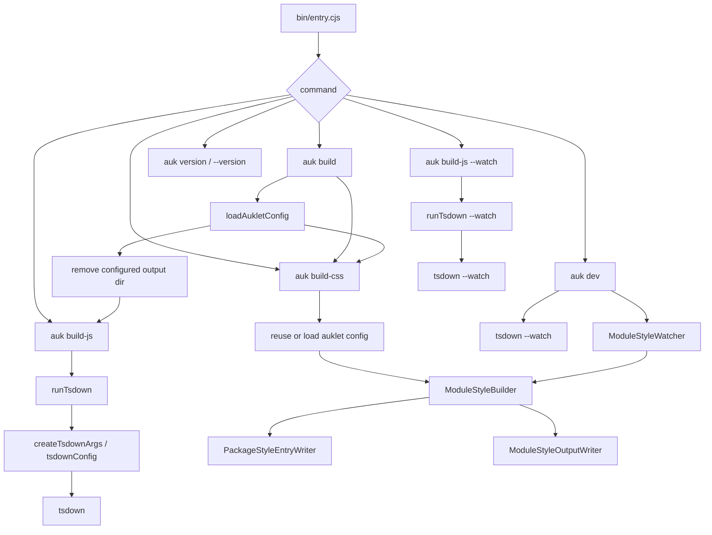
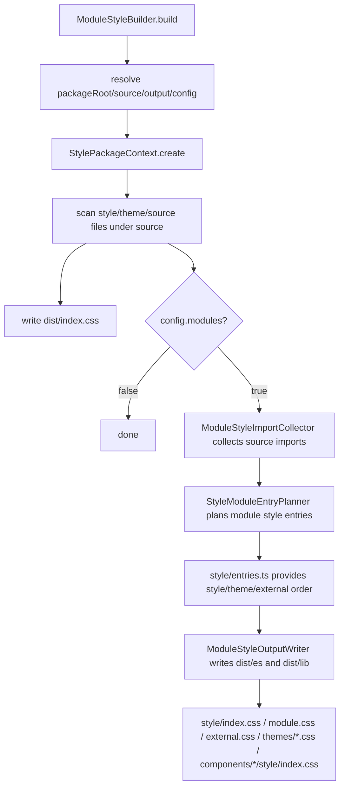
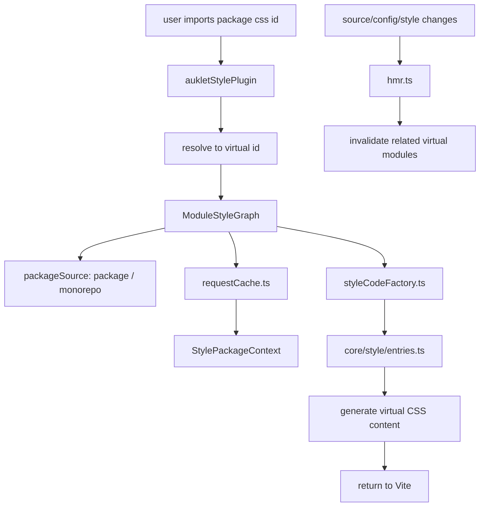

# Contributing Guide

This document is for future maintainers and collaborating AI agents. It explains
auklet's current code architecture, core module responsibilities, and build
flows. Before changing implementation code, read this document and `TESTING.md`.

## Project Scope

auklet is a build tool for TypeScript packages. It provides two main capability
areas:

- JavaScript/TypeScript builds: generate bundle, global, and module output based
  on `tsdown`.
- Style builds: generate package CSS, module CSS, theme CSS, external CSS, and
  virtual CSS entries for Vite dev mode.

This repository itself is a single-package project. `examples/` contains real
project-shape demos for debugging and testing both monorepo and single-package
scenarios.

## Naming Conventions

Use `Style` for internal style build concepts, such as `ModuleStyleBuilder`,
`ModuleStyleGraph`, and `PackageStyleEntryWriter`. This keeps core abstractions
stable if auklet later supports other style languages such as Less.

Keep `css` only where the API or artifact is explicitly CSS-oriented:

- Directory name: `src/css/`, because the current module still handles CSS
  output.
- CLI command: `auk build-css`, because the user-facing command should stay
  obvious.
- File names and import ids: `style.css`, `module.css`, `external.css`,
  `auklet-css:*`.
- Log prefix: `[auklet:css]`.

## Repository Layout

```text
.
├── bin/                  # CLI entry, exposed as auk / auklet after publishing
├── src/                  # Tool source
├── examples/             # Real demos and example-level tests
├── TESTING.md            # Test architecture and test style guide
├── README.md             # User-facing documentation
├── package.json          # Package metadata, scripts, exports/imports
└── tsconfig.json         # TypeScript config for this package
```

## Source Modules

```text
src/
├── index.ts              # Public API exports
├── types.ts              # User config, internal config, and build context types
├── config.ts             # Defaults and config normalization
├── configLoader.ts       # Loads auklet.config.ts
├── utils.ts              # Shared path and file utilities
├── build/                # JavaScript build flow
└── css/                  # Style build flow
```

### Config Modules

- `types.ts` defines `AukletConfig`, `NormalizedAukletConfig`,
  `PackageBuildOptions`, `ModuleStyleBuildConfig`, and related types.
- `config.ts` defines defaults and normalizes user config into a stable internal
  shape.
- `configLoader.ts` loads `auklet.config.ts` from a package root. It supports
  TypeScript config files and cache busting.

Config rules:

- Public APIs use `AukletConfig`.
- Internal core modules should prefer `NormalizedAukletConfig`.
- Defaults belong in `config.ts`; do not duplicate default config in multiple
  modules.

### JavaScript Build Modules

```text
src/build/
├── bundleConfig.ts       # Bundle format config
├── cleanOutput.ts        # Cleans output directory for auk build
├── moduleConfig.ts       # Unbundled module config
├── runTsdown.ts          # CLI/API entry for running tsdown
├── tsdownConfig.ts       # Compatibility entry forwarding to tsdown/define
└── tsdown/               # Generates tsdown config from auklet config and package.json
    ├── define.ts         # Public defineKernelPackageConfig* entry
    ├── context.ts        # Reads package.json and creates build context
    ├── dependencies.ts   # external, alwaysBundle, and globals rules
    ├── entries.ts        # Bundle/module entry collection
    ├── parseModuleId.ts  # Module id parser used by IIFE dependency classification
    ├── common.ts         # Shared tsdown config and user callback handling
    └── types.ts          # Internal build config types
```

`runTsdown` is the execution layer. It builds command arguments and invokes
tsdown. `cleanOutput` only serves `auk build`; it removes the current package's
configured `output` directory. `tsdownConfig` is the config translation layer
that maps auklet `build` options to tsdown config.

### Style Core Modules

```text
src/css/
├── config.ts                     # Default CSS output structure config
├── constants.ts                  # CSS/source file matching constants
└── core/
    ├── stylePackageContext.ts        # Collects style build context for one package
    ├── styleProcessor.ts             # Reads, merges, and expands style content
    ├── workspaceStyleResolver.ts     # Resolves workspace/package/node_modules style deps
    ├── styleImports/                 # Infers style deps from TSX imports/re-exports
    │   ├── collector.ts              # Builds module style imports from source refs and config
    │   ├── autoImportRules.ts        # Auto import rule matching and specifier generation
    │   └── sourceImportExportAnalyzer.ts # Parses TSX import/re-export syntax
    ├── resolvers/                    # Same-package source import candidate resolvers
    │   ├── relative.ts               # Relative imports
    │   ├── packageImports.ts         # package.json#imports, preferring source condition
    │   └── tsconfigPaths.ts          # tsconfig compilerOptions.paths
    ├── styleModuleEntryPlanner.ts    # Plans module-level style entries
    └── style/
        ├── dependencies.ts           # Reads global/theme/external deps from config
        ├── entries.ts                # package/theme/external/module entry semantics
        ├── files.ts                  # Style file scanning
        └── specifier.ts              # Package style specifier parsing/generation
```

Key modules:

- `StylePackageContext`: aggregates package root, source/output directories,
  theme files, style files, resolver, and processor. It is shared by production
  and dev paths.
- `StyleProcessor`: handles CSS content work such as reading files, expanding
  `@import`, and merging PostCSS roots.
- `WorkspaceStyleResolver`: resolves style dependencies from config to real
  files or output paths, accounting for workspace packages and external
  packages.
- `styleImports/collector.ts`: scans only `.tsx` source files. It infers
  module-level style imports from imports / named re-exports and
  `styles.dependencies.*.components`. `.ts` files do not participate in CSS auto
  import. `export * from '...'` is unsupported because exported component names
  cannot be inferred reliably. Same-package source dependencies are resolved
  through `resolvers/` and are constrained to the current package `sourceRoot`.
- `styleImports/autoImportRules.ts`: turns `components` config into internal
  auto import rules. It handles package-entry named imports, deep imports, and
  specifier generation.
- `styleImports/sourceImportExportAnalyzer.ts`: only handles TypeScript AST
  import/export analysis and emits module import references consumed by the
  collector.
- `resolvers/`: turns source import specifiers into candidate relative paths
  inside the current package source tree. It does not check whether style files
  exist and does not infer output directories. `packageImports` uses
  `conditional-export` for `package.json#imports` and prefers the `source`
  condition. `tsconfigPaths` reads `compilerOptions.paths` through TypeScript,
  supports `extends`, and prefers more specific patterns.
- `StyleModuleEntryPlanner`: creates module-level style entry plans from source
  directories and collected imports.
- `style/entries.ts`: environment-neutral style graph entry semantics. It
  exposes package, theme, external, and module entries consumed by both
  production writers and Vite/dev renderers.

### Style Production Modules

```text
src/css/production/
├── builder.ts                       # CSS build entry
├── packageEntryWriter.ts           # Writes package-level dist/index.css
├── moduleOutputWriter.ts            # Orchestrates modular CSS output under dist/es and dist/lib
└── format/
    ├── sourceWriter.ts              # Copies source style files
    ├── entryWriter.ts               # Writes style/index.css
    ├── moduleWriter.ts              # Writes style/module.css
    ├── externalWriter.ts            # Writes style/external.css
    ├── themeWriter.ts               # Writes style/themes and theme entries
    ├── moduleEntryWriter.ts         # Writes module-level style/index.css
    └── shared.ts                    # Shared types and path helpers for format writers
```

- `ModuleStyleBuilder` orchestrates the build: resolve context, decide whether
  module output is needed, call the package entry writer and module output
  writer, and emit logs.
- `PackageStyleEntryWriter` only writes the package-level aggregate
  `dist/index.css`.
- `ModuleStyleOutputWriter` only orchestrates output under `dist/es` and
  `dist/lib`; actual file writes are handled by atomic writers in `format/`.

Production file responsibilities:

- `builder.ts`: production CSS build entry. It creates build context,
  `StylePackageContext`, decides whether to run module output, and summarizes
  logs.
- `packageEntryWriter.ts`: writes `dist/index.css`. It aggregates current
  package themes, global style dependencies, and current package source styles
  into one real CSS file.
- `moduleOutputWriter.ts`: orchestrates format output when `modules` is enabled.
  It iterates `es`, `lib`, and other output formats, then calls atomic writers
  under `format/` in order.
- `format/sourceWriter.ts`: copies source style files into the current format
  output directory so module-level entries can reference them.
- `format/entryWriter.ts`: writes the current format's style entry, such as
  `dist/es/style/index.css`. Entry composition order comes from
  `style/entries.ts`.
- `format/moduleWriter.ts`: writes current package module styles, such as
  `dist/es/style/module.css`.
- `format/externalWriter.ts`: writes external style entries, such as
  `dist/es/style/external.css`.
- `format/themeWriter.ts`: writes theme output, including
  `dist/es/style/themes/*.css` and `dist/es/themes/*.css`.
- `format/moduleEntryWriter.ts`: writes module-level style entries, such as
  `dist/es/components/Button/style/index.css`.
- `format/shared.ts`: shared types, empty-entry comments, and relative import
  path helpers for format writers.

Production modules should not reimplement dev graph entry semantics. Entry
composition order should come from `style/entries.ts`.

### Style Dev/Vite Modules

```text
src/css/vite/
├── vitePlugin.ts        # Vite plugin entry
├── hmr.ts               # Style-related HMR checks and updates
└── moduleGraph/         # Vite/dev virtual CSS graph
    ├── graph.ts         # Graph facade, watch boundaries, and package source dispatch
    ├── styleCodeFactory.ts
    ├── requestCache.ts
    ├── devDependency.ts
    ├── loadResult.ts
    ├── styleId.ts
    ├── packageSource/
    │   ├── monorepo.ts
    │   ├── singlePackage.ts
    │   └── types.ts
    └── types.ts
```

The Vite plugin turns package CSS imports into virtual modules and calls
`moduleGraph/` to generate CSS. HMR logic decides which virtual CSS modules to
invalidate when source, config, or style files change.

- `moduleGraph/graph.ts`: Vite/dev graph facade. It creates request caches from
  virtual CSS ids and dispatches to CSS generators.
- `moduleGraph/styleCodeFactory.ts`: generates virtual CSS from
  `style/entries.ts` and recursively resolves package style dependencies.
- `moduleGraph/requestCache.ts`: caches package context within a single graph
  request to avoid repeated loading and scanning.
- `moduleGraph/devDependency.ts`: resolves third-party CSS dependencies from the
  package root that declares them and emits Vite `/@fs/...` imports, avoiding
  lost `node_modules` resolution context from virtual modules.
- `moduleGraph/packageSource/`: abstracts where dev graph packages come from.
  `singlePackage.ts` uses Vite root as the current package root; `monorepo.ts`
  scans workspace packages.

### Watch Module

```text
src/css/watch/
└── watcher.ts
```

`ModuleStyleWatcher` powers `auk build-css --watch` and `auk dev`. It watches
package source/config/style changes and debounces calls to `ModuleStyleBuilder`.

## CLI Flow

The CLI entry is `bin/entry.cjs`, exposed as `auk` and `auklet` after
publishing.



## JavaScript Build Flow


Key rules:

- `build.target` defaults to `es2020`.
- `build.platform` defaults to `neutral`.
- `build.tsconfig` defaults to the nearest `tsconfig.json` found by walking
  upward from the package root.
- `dependencies`, `peerDependencies`, and `build.externals` are sources for
  externals.
- `build.alias` is passed through to tsdown `alias` and applies to bundle and
  module output.
- `build.globals` is merged into IIFE `output.globals` and overrides global
  names inferred from external package names.
- `build.mainFields` is passed to rolldown `resolve.mainFields` through tsdown
  `inputOptions` for bundle output. When omitted, only IIFE bundles get the
  default `['browser', 'module', 'main']`, which helps browser dependencies that
  only define `package.json#main`. Unbundled output under `modules: true` does
  not set extra main fields.
- `build.configureTsdown` is the final tsdown config hook. `kind` is either
  `bundle` or `module`, corresponding to package-level bundle output and
  unbundled output under `modules: true`.
- When `modules: true`, auklet generates module output such as `dist/es` and
  `dist/lib`; module-level CSS output follows the same behavior.

## CSS Production Build Flow



Output semantics:

- `dist/index.css`: package-level aggregate CSS for direct package style imports.
- `dist/{es,lib}/style/index.css`: style entry for the current format.
- `dist/{es,lib}/style/module.css`: module style collection for the current
  package.
- `dist/{es,lib}/style/external.css`: external style entry.
- `dist/{es,lib}/themes/*.css`: theme entries including theme dependencies and
  current theme files.
- `dist/{es,lib}/components/*/style/index.css`: module-level style entry.
  `components/` is a common output path, not a restriction that only components
  are supported internally.

## CSS Dev/Vite Flow



The dev flow does not write real output. It generates virtual CSS content. It
shares `core/style/entries.ts` with production writers to keep these semantics
aligned:

- which parts are included in the style entry and in what order;
- whether theme entries include theme dependencies and current theme content;
- how external style dependencies are represented.

Virtual dev CSS keeps inter-package style dependencies as recursive virtual CSS.
Third-party CSS dependencies are resolved from the package root that declares
them and emitted as Vite `/@fs/...` imports, avoiding PostCSS/Vite resolution
failures from consumer project or virtual module context.

The Vite plugin supports two package sources:

- `mode: 'package'`: default. Vite root is the current package root, intended
  for single-package component libraries.
- `mode: 'monorepo'`: walks upward from Vite root to find `pnpm-workspace.yaml`
  and scans workspace packages.

## Examples

```text
examples/
├── monorepo-package/ # Component library monorepo demo
├── monorepo-lib/     # Pure lib monorepo demo
├── single-package/   # Single-package component library demo with Vite dev mode
├── single-lib/       # Single-package pure TypeScript lib demo
└── __tests__/        # Example output tests
```

Examples cover real usage scenarios:

- `monorepo-package`: includes theme, ui, dashboard, and related packages,
  covering component libraries, theme dependencies, and inter-package component
  dependencies.
- `monorepo-lib`: covers pure TypeScript library builds without CSS.
- `single-package`: covers default `aukletStylePlugin()` package mode and
  single-package component CSS builds.
- `single-lib`: covers single-package pure TypeScript library builds, where CSS
  output is expected to be empty.
- `examples/__tests__`: checks JavaScript output, CSS output, and directory
  structure after example builds.

Root `pnpm build:examples` builds packages under examples. `pnpm test:examples`
builds examples first and then runs example tests. `pnpm dev:examples` starts
demos that expose a dev script for manual checks.

## Testing Strategy

See `TESTING.md` for the full test guide. The most important maintenance rules
are:

```text
src/__tests__/
├── build/                       # clean output, tsdown args/config tests
├── css/
│   ├── builder/                 # production CSS builder branch tests
│   ├── moduleGraph/             # Vite/dev graph, cache, source boundary tests
│   │   └── packageSource/       # monorepo/package source focused tests
│   ├── resolvers/               # relative/imports/tsconfig paths resolver tests
│   ├── styleImports/            # auto import rules and collector tests
│   ├── hmr.spec.ts
│   ├── path.spec.ts
│   ├── styleProcessor.spec.ts
│   ├── styleSpecifier.spec.ts
│   ├── watcher.spec.ts
│   └── workspaceStyleResolver.spec.ts
├── e2e/                         # project-level style output and package mode smoke tests
├── fixtures/                    # virtual project and style structure helpers
├── configLoader.spec.ts
└── index.spec.ts
```

- Changes that affect final output structure or dev/production semantic
  alignment need project-level e2e coverage.
- Single-module boundary behavior belongs in that module's unit tests.
- File-system tests use `src/__tests__/fixtures/virtualProject.ts`; temporary
  files live in `src/__tests__/.tmp/`.
- Prefer normalizing real build output and Vite/dev graph output into the same
  `StyleStructure` before assertions.
- Do not wrap pure `readFile/writeFile` forwarding helpers in tests.

Common verification commands:

```bash
pnpm run typecheck
pnpm run test
pnpm run build
pnpm run test:examples
```

## Change Checklist

- Config field changes: check `types.ts`, `config.ts`, `README.md`, test
  fixtures, and examples.
- CSS entry order changes: update `src/css/core/style/entries.ts` first, then
  check production and dev consumers.
- New style dependency type: check `dependencies.ts`, `workspaceStyleResolver.ts`,
  `styleImports/collector.ts`, `moduleGraph/`, and `StyleStructure` test
  helpers.
- New CLI behavior: check `bin/entry.cjs`, README CLI docs, and necessary unit
  tests.
- New public API: check `src/index.ts` and README Programmatic API docs.

## Code Style

- Exported normal functions should prefer `function` declarations.
- Non-exported local helpers may use arrow functions.
- Functions usually do not need explicit return type annotations; use
  `satisfies` on returned values when the return structure needs constraints.
- Use posix `/` semantics for output and test assertions. Absolute file-system
  paths should only appear in internal resolution steps.
- Do not spread CSS-specific naming into generic modules that may support other
  style languages later. Generic layers should prefer `style` naming.
