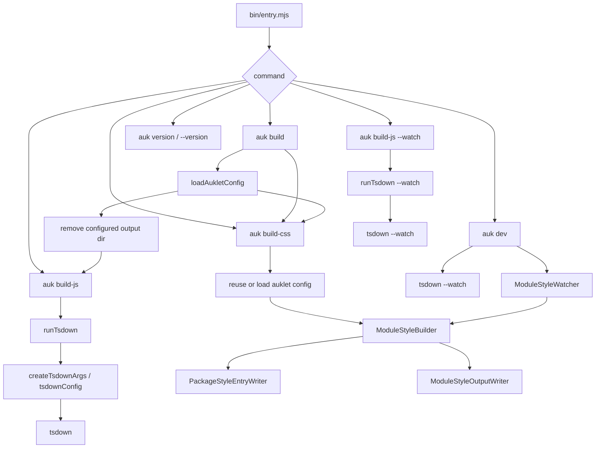
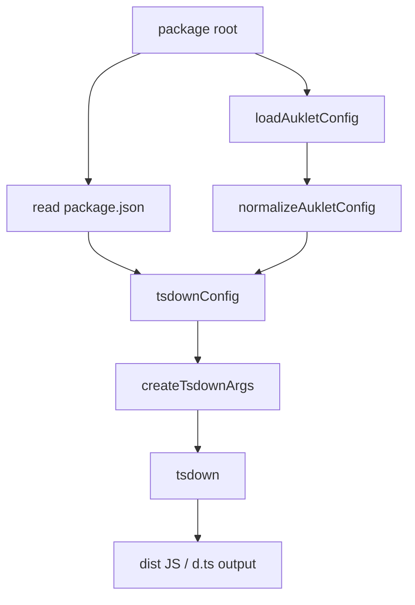
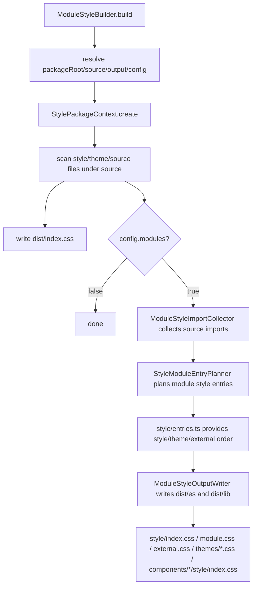
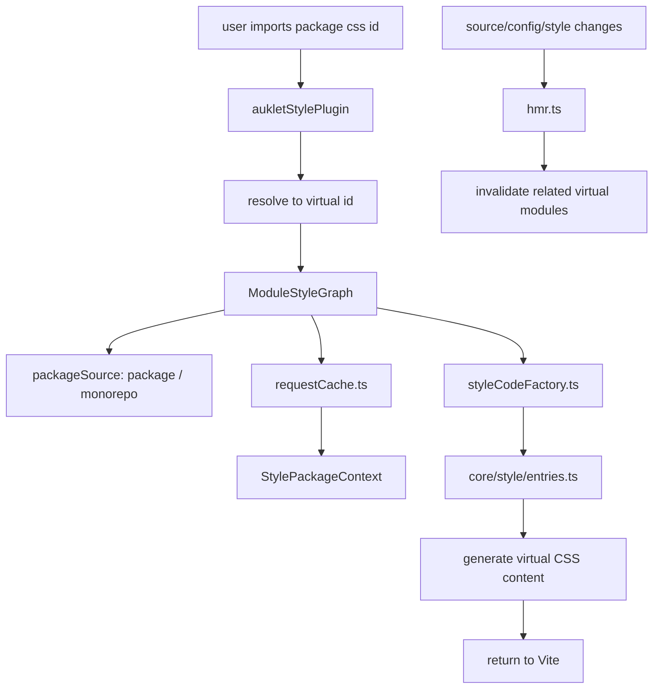

# 贡献者指南

这份文档面向后续维护者和协作型 AI agent。它说明 auklet 当前的代码架构、核心模块职责和构建流程。修改实现代码前，请先阅读本文件和 `TESTING.md`。

## 项目范围

auklet 是面向 TypeScript 包的构建工具。它目前提供两类主要能力：

- JavaScript/TypeScript 构建：基于 `tsdown` 生成 bundle、global 和 module 产物。
- 样式构建：生成 package CSS、module CSS、theme CSS、external CSS，以及 Vite dev 模式下的虚拟 CSS entry。

本仓库自身是单包项目。`examples/` 中包含真实项目形态的 demo，用于调试和测试 monorepo 与 single-package 场景。

## 命名约定

内部样式构建概念使用 `Style` 命名，例如 `ModuleStyleBuilder`、`ModuleStyleGraph` 和 `PackageStyleEntryWriter`。这样可以保持核心抽象稳定，即使后续 auklet 支持 Less 等其他样式语言。

只有 API 或产物明确面向 CSS 时才使用 `css`：

- 目录名：`src/css/`，因为当前模块确实处理 CSS 产物。
- CLI 命令：`auk build-css`，因为面向用户的命令需要直观。
- 文件名和 import id：`style.css`、`module.css`、`external.css`、`auklet-css:*`。
- 日志前缀：`[auklet:css]`。

## 仓库结构

```text
.
├── bin/                  # CLI 入口，发布后暴露为 auk / auklet
├── src/                  # 工具源码
├── examples/             # 真实 demo 和 example 级别测试
├── TESTING.md            # 测试架构和测试风格指南
├── README.md             # 面向用户的文档
├── package.json          # 包元信息、scripts、exports/imports
└── tsconfig.json         # 本包 TypeScript 配置
```

## 源码模块

```text
src/
├── index.ts              # Public API exports
├── types.ts              # 用户配置、内部配置和构建上下文类型
├── config.ts             # 默认值和配置归一化
├── configLoader.ts       # 加载 auklet.config.ts
├── cli/                  # CLI 命令注册和 command runners
├── utils.ts              # 共享路径和文件工具
├── build/                # JavaScript 构建流程
└── css/                  # 样式构建流程
```

### Config 模块

- `types.ts` 定义 `AukletConfig`、`NormalizedAukletConfig`、`PackageBuildOptions`、`ModuleStyleBuildConfig` 以及相关类型。
- `config.ts` 定义默认值，并把用户配置归一化成稳定的内部结构。
- `configLoader.ts` 从 package root 加载 `auklet.config.ts`，支持 TypeScript 配置文件和 cache busting。

配置规则：

- Public API 使用 `AukletConfig`。
- 内部核心模块优先使用 `NormalizedAukletConfig`。
- 默认值属于 `config.ts`，不要在多个模块中重复默认配置。

### JavaScript Build 模块

```text
src/build/
├── bundleConfig.ts       # Bundle format 配置
├── cleanOutput.ts        # 为 auk build 清理输出目录
├── moduleConfig.ts       # Unbundled module 配置
├── runTsdown.ts          # 运行 tsdown 的 CLI/API 入口
├── tsdownConfig.ts       # 兼容入口，转发到 tsdown/define
└── tsdown/               # 根据 auklet config 和 package.json 生成 tsdown config
    ├── define.ts         # Public defineKernelPackageConfig* 入口
    ├── context.ts        # 读取 package.json 并创建构建上下文
    ├── dependencies.ts   # external、alwaysBundle 和 globals 规则
    ├── entries.ts        # Bundle/module entry 收集
    ├── parseModuleId.ts  # IIFE 依赖分类使用的 module id parser
    ├── common.ts         # 共享 tsdown config 和用户 callback 处理
    └── types.ts          # 内部构建配置类型
```

`runTsdown` 是执行层，负责构造命令参数并调用 tsdown。`cleanOutput` 只服务 `auk build`，它会删除当前 package 配置的 `output` 目录。`tsdownConfig` 是配置翻译层，负责把 auklet 的 `build` 配置映射到 tsdown config。

Build CLI override 在 `src/cli/buildArgs.ts` 中解析。`--source`、`--output`、
`--modules` 这类顶层参数，以及 `--build.formats`、`--build.target`、
`--build.platform`、`--build.tsconfig` 这类命名空间参数，会覆盖当前命令中
的 `auklet.config.ts` 配置。JS 构建路径会通过 `AUKLET_CONFIG_OVERRIDES`
把这些 override 传给 tsdown 子进程，并由 auklet 内置 tsdown config 读取。
不要把这些参数和 tsdown 的 `--config`、`-c` 或 `--no-config` 混用；自定义
tsdown config 需要自己决定如何加载配置。

### CLI 模块

```text
src/cli/
├── main.ts               # 命令注册和顶层错误边界
├── build.ts              # build/build-js 命令编排
├── buildCss.ts           # build-css 命令编排和 watch 生命周期
├── dev.ts                # dev 命令进程编排
├── publish.ts            # publish 和 owner 命令编排
└── buildArgs.ts          # auklet build override 解析和校验
```

`bin/entry.mjs` 应该保持为 bootstrap 文件，只从构建后的 public API 引入。
`src/cli/main.ts` 负责命令注册；具体命令的业务逻辑放到对应 runner 文件中。
`src/cli/publish.ts` 只是顶层 CLI glue；publish 参数解析属于
`src/publish/cli.ts`。

### Style Core 模块

```text
src/css/
├── config.ts                     # 默认 CSS 输出结构配置
├── constants.ts                  # CSS/source 文件匹配常量
└── core/
    ├── stylePackageContext.ts        # 收集单个 package 的样式构建上下文
    ├── styleProcessor.ts             # 读取、合并、展开样式内容
    ├── workspaceStyleResolver.ts     # 解析 workspace/package/node_modules 样式依赖
    ├── styleImports/                 # 从 TSX import/re-export 推断样式依赖
    │   ├── collector.ts              # 根据 source refs 和 config 构建 module style imports
    │   ├── autoImportRules.ts        # Auto import rule 匹配和 specifier 生成
    │   └── sourceImportExportAnalyzer.ts # 解析 TSX import/re-export 语法
    ├── resolvers/                    # 当前包 source import 候选解析器
    │   ├── relative.ts               # 相对路径 import
    │   ├── packageImports.ts         # package.json#imports，优先 source condition
    │   └── tsconfigPaths.ts          # tsconfig compilerOptions.paths
    ├── styleModuleEntryPlanner.ts    # 规划 module-level style entries
    └── style/
        ├── dependencies.ts           # 从 config 读取 global/theme/external deps
        ├── entries.ts                # package/theme/external/module entry 语义
        ├── files.ts                  # Style 文件扫描
        └── specifier.ts              # Package style specifier 解析/生成
```

关键模块：

- `StylePackageContext`：聚合 package root、source/output 目录、theme files、style files、resolver 和 processor。生产构建与 dev 路径共享它。
- `StyleProcessor`：处理 CSS 内容工作，例如读取文件、展开 `@import`、合并 PostCSS roots。
- `WorkspaceStyleResolver`：把 config 中的样式依赖解析到真实文件或输出路径，兼顾 workspace package 和 external package。
- `styleImports/collector.ts`：只扫描 `.tsx` 源文件。它从 imports / named re-exports 以及 `styles.dependencies.*.components` 推断 module-level style imports。`.ts` 文件不参与 CSS auto import。`export * from '...'` 不支持，因为无法可靠推断最终导出的组件名。同包 source 依赖通过 `resolvers/` 解析，并被限制在当前 package 的 `sourceRoot` 中。
- `styleImports/autoImportRules.ts`：把 `components` 配置转换成内部 auto import rules，处理 package-entry named imports、deep imports 和 specifier 生成。
- `styleImports/sourceImportExportAnalyzer.ts`：只负责 TypeScript AST import/export 分析，并输出 collector 消费的 module import references。
- `resolvers/`：把 source import specifier 转成当前 package source tree 内的候选相对路径。它不检查 style file 是否存在，也不推断输出目录。`packageImports` 使用 `conditional-export` 处理 `package.json#imports` 并优先 `source` condition。`tsconfigPaths` 通过 TypeScript 读取 `compilerOptions.paths`，支持 `extends`，并优先更具体的 pattern。
- `StyleModuleEntryPlanner`：根据 source directories 和收集到的 imports 创建 module-level style entry plans。
- `style/entries.ts`：与环境无关的 style graph entry 语义。它暴露 package、theme、external 和 module entries，供 production writers 与 Vite/dev renderers 共同消费。

### Style Production 模块

```text
src/css/production/
├── builder.ts                       # CSS 构建入口
├── packageEntryWriter.ts           # 写入 package-level dist/index.css
├── moduleOutputWriter.ts            # 编排 dist/es 和 dist/lib 下的 modular CSS 输出
└── format/
    ├── sourceWriter.ts              # 复制 source style files
    ├── entryWriter.ts               # 写入 style/index.css
    ├── moduleWriter.ts              # 写入 style/module.css
    ├── externalWriter.ts            # 写入 style/external.css
    ├── themeWriter.ts               # 写入 style/themes 和 theme entries
    ├── moduleEntryWriter.ts         # 写入 module-level style/index.css
    └── shared.ts                    # format writers 共享类型和路径 helper
```

- `ModuleStyleBuilder` 编排构建：解析上下文、判断是否需要 module output、调用 package entry writer 和 module output writer，并输出日志。
- `PackageStyleEntryWriter` 只写 package-level aggregate `dist/index.css`。
- `ModuleStyleOutputWriter` 只编排 `dist/es` 和 `dist/lib` 下的输出；实际写文件由 `format/` 中的原子 writer 负责。

生产构建文件职责：

- `builder.ts`：生产 CSS 构建入口。它创建 build context、`StylePackageContext`，判断是否运行 module output，并汇总日志。
- `packageEntryWriter.ts`：写入 `dist/index.css`。它把当前包 themes、global style dependencies 和当前包 source styles 聚合成一个真实 CSS 文件。
- `moduleOutputWriter.ts`：在启用 `modules` 时编排 format output。它遍历 `es`、`lib` 和其他 output formats，然后按顺序调用 `format/` 下的原子 writer。
- `format/sourceWriter.ts`：把 source style files 复制到当前 format 输出目录，供 module-level entries 引用。
- `format/entryWriter.ts`：写入当前 format 的 style entry，例如 `dist/es/style/index.css`。Entry 组合顺序来自 `style/entries.ts`。
- `format/moduleWriter.ts`：写入当前包 module styles，例如 `dist/es/style/module.css`。
- `format/externalWriter.ts`：写入 external style entries，例如 `dist/es/style/external.css`。
- `format/themeWriter.ts`：写入 theme output，包括 `dist/es/style/themes/*.css` 和 `dist/es/themes/*.css`。
- `format/moduleEntryWriter.ts`：写入 module-level style entries，例如 `dist/es/components/Button/style/index.css`。
- `format/shared.ts`：format writers 共享类型、empty-entry comments 和 relative import path helpers。

Production 模块不应该重新实现 dev graph entry 语义。Entry 组合顺序应该来自 `style/entries.ts`。

### Style Dev/Vite 模块

```text
src/css/vite/
├── vitePlugin.ts        # Vite plugin 入口
├── hmr.ts               # 样式相关 HMR 检查和更新
└── moduleGraph/         # Vite/dev 虚拟 CSS graph
    ├── graph.ts         # Graph facade、watch boundaries、package source dispatch
    ├── styleCodeFactory.ts
    ├── requestCache.ts
    ├── devDependency.ts
    ├── loadResult.ts
    ├── styleId.ts
    ├── packageSource/
    │   ├── monorepo.ts
    │   ├── singlePackage.ts
    │   └── types.ts
    └── types.ts
```

Vite plugin 把 package CSS imports 转成虚拟模块，并调用 `moduleGraph/` 生成 CSS。HMR 逻辑负责判断 source、config 或 style 文件变化时，哪些虚拟 CSS modules 需要失效。

- `moduleGraph/graph.ts`：Vite/dev graph facade。它根据虚拟 CSS ids 创建 request caches，并分发到 CSS generators。
- `moduleGraph/styleCodeFactory.ts`：根据 `style/entries.ts` 生成虚拟 CSS，并递归解析 package style dependencies。
- `moduleGraph/requestCache.ts`：在一次 graph request 内缓存 package context，避免重复加载和扫描。
- `moduleGraph/devDependency.ts`：从声明依赖的 package root 解析第三方 CSS dependencies，并生成 Vite `/@fs/...` imports，避免虚拟模块丢失 `node_modules` 解析上下文。
- `moduleGraph/packageSource/`：抽象 dev graph packages 的来源。`singlePackage.ts` 使用 Vite root 作为当前 package root；`monorepo.ts` 通过 pnpm 读取 workspace packages，过滤 workspace root package，并在 workspace 读取失败时直接暴露错误。

### Watch 模块

```text
src/css/watch/
└── watcher.ts
```

`ModuleStyleWatcher` 支撑 `auk build-css --watch` 和 `auk dev`。它监听 package source/config/style 变化，并 debounce 调用 `ModuleStyleBuilder`。

## CSS 能力边界

CSS 子系统是规则化 style entry generator，不是完整 CSS bundler，也不是 Vite/PostCSS 的替代品。修改行为或文档时要保持这个边界清晰：auklet 决定哪些 style entry 文件存在、哪些依赖参与这些 entries、以及生产输出和 Vite dev 虚拟 CSS 如何保持一致。它不目标实现 CSS 语言的所有能力。

### 支持的模型

auklet 支持以下用户模型：

- package style entry：package-level aggregate CSS，例如 `dist/index.css`；
- module style entry：按 source module 生成的 CSS，例如 `dist/es/components/Button/style/index.css`；
- theme style entry：配置的 theme files 及其依赖 themes；
- external style entry：配置的第三方或 workspace package style dependencies；
- Vite dev virtual entries：与 package/module/theme/external 相同模型的虚拟 entries。

支持的输入面有意保持较窄：

- Source style files 是配置 source root 下发现的普通 CSS 文件。
- 当前包 theme entries 来自 `styles.themes`。
- External package style entries、theme entries 和 component auto-import rules 来自 `styles.dependencies`。
- Module auto imports 从 `.tsx` imports 和 named re-exports 推断。`.ts`、`.d.ts` 和 `export * from` 不在推断模型内。
- 同包 source specifiers 可以通过相对路径、`package.json#imports` 或 `tsconfig.compilerOptions.paths` 解析，但解析结果必须留在当前 package source root 内。

### Import 语义

`StyleProcessor` 会展开本地 CSS `@import` 规则，让生成的 entries 可以合并 source styles 并避免重复内容。把它理解为 source-file composition，而不是完整 CSS bundling。

支持的 import 行为：

- source style files 内的本地相对 CSS imports；
- 带循环保护的递归本地 imports；
- 为保证生成输出稳定而做的重复本地 import/content 去重；
- auklet 输出 entries 之间生成的 `@import` 路径，由 `style/entries.ts` 和 production/dev writers 产生。

不在范围内：

- `url(...)` rebasing；
- CSS Modules class name transformation；
- Sass/Less/Stylus 或其他预处理器；
- minification、autoprefixing、nesting transforms 或其他 PostCSS plugin 行为；
- 超出配置 style dependencies 的任意 package CSS bundling；
- media、supports、layer-specific import conditions 等条件 CSS imports 的语义处理。

如果后续要支持新的 CSS 语法或 transform，先判断它应该进入 auklet core，还是继续交给使用方的构建栈。不要在 entry writers 里悄悄加入不完整的 bundler 行为。

### 生产与 Dev 对齐

Production output 和 Vite dev virtual CSS 必须共享同一套 entry 语义：

- entry 组合顺序放在 `src/css/core/style/entries.ts`；
- production writers 不应该发明 Vite graph 无法复现的顺序；
- Vite graph code 不应该接受 production output 无法表达的 package/style ids；
- dev 中第三方 CSS dependencies 应该继续从声明它们的 package root 解析，通常通过 Vite `/@fs/...` imports；
- dev 中 workspace package style dependencies 应该保持虚拟且递归，这样 HMR 才能跟踪跨包 source changes。

修改 CSS 行为时，要同时更新 production 和 dev 路径，或者明确说明该行为为什么只适用于 production 或 dev。较大的语义变更通常需要 project-level tests，对比归一化后的 production output 和 Vite/dev graph output。

## CLI 流程

CLI 入口是 `bin/entry.mjs`，发布后暴露为 `auk` 和 `auklet`。



## Publish 流程

Publish 是建立在 auklet build 之上的辅助工作流。Publish 编排应留在
`src/publish/`，不要放进 `bin/entry.mjs`。顶层 `src/cli/publish.ts` runner 只负责
转发到 publish 子域；`src/publish/cli.ts` 负责 publish/owner 子命令参数解析、
pnpm preflight，并把类型化 options 交给 runners。

```text
src/publish/
├── cli.ts                 # publish/owner 子命令 flags 和校验
├── publishRunner.ts       # 顶层 publish 状态机
├── targetResolver.ts      # package target 发现、过滤和排序
├── version.ts             # --version 解析
├── api/                   # git、package.json、pnpm 和 hook 命令适配器
└── runner/                # build、format、preflight、git、version、publish 阶段
```

`PublishRunner` 拥有状态机。其他 publish 模块应保持单一职责，避免决定跨阶段顺序。

### 状态顺序

正常 publish 顺序：

```text
parse CLI flags
ensure pnpm
resolve publish plan
validate build scripts
initial git clean check unless `--dry-run` or `--allow-dirty`
log dry-run version plan when needed
beforeBuild hook
write package.json versions when `--version` and not `--dry-run`
pnpm run build for each target
afterBuild hook
format publish outputs unless `--no-format` is set
beforePublish hook
pnpm publish `--dry-run` preflight for each target
commit release changes and create tag when real publish can use git
pnpm publish for each target when not `--dry-run`
afterPublish hook with success result
```

Dry-run 在 preflight publish loop 后停止。它仍然会解析版本、运行 build、运行 hooks，并在未传 `--no-format` 时格式化输出，但不会写入 `package.json#version`、创建 git commit/tag 或执行真实 registry publish。

### 版本和 Git 规则

- 不传 `--version` 时，publish 使用 `package.json` 中已有版本。
- 真实 publish 且传 `--version` 时，`VersionWriter` 在 build 开始前写入 root/current package version 和每个 selected target version。
- `--version --dry-run` 时，版本只计算和打印。Build 和 pnpm preflight 仍读取原始 package files。
- 真实 publish 在 build 前要求 git 工作区干净，除非设置了 `--allow-dirty`。
- `--allow-dirty` 会跳过初始 clean check、post-build dirty check、release commit 和 tag。它仍然可以写版本并发布。
- Release commit/tag 发生在 preflight 成功之后、真实逐包 publish 之前。这样版本/build/format 变更会在任何 registry publish 之前进入 commit。

### Hooks 和失败处理

Publish hooks 从 `package.json#auklet.publish` 读取。Monorepo publish 中，只使用 workspace root publish config 作为编排 hooks。

- `beforeBuild` 在 plan 有效之后、任何版本写入之前运行。
- 如果 `beforeBuild` 失败，publish 立即停止，并且不运行 `afterPublish`。
- `afterBuild` 在所有 package build 完成之后、output formatting 之前运行。
- `beforePublish` 在 build 和 formatting 完成之后、pnpm preflight 之前运行。
- `afterPublish` 在 publish/preflight 完成后或后续阶段失败后运行一次。它会收到 `AUKLET_PUBLISH_RESULT=success` 或 `failure`。
- 如果 `afterBuild`、formatting、`beforePublish`、preflight、git commit/tag 或真实 publish 失败，`afterPublish` 仍会带 failure metadata 运行。
- 如果真实 publish 部分成功，`PackagePublisher` 在第一个失败 target 处停止，`publishFailureReporter` 记录已经发布成功的 packages。Auklet 永远不会回滚 package versions 或 registry publishes。

### Target 和 Formatting 规则

- 不传 `--filter`：发布当前 package root。
- 传 `--filter`：要求存在 pnpm workspace root，选择匹配的 workspace packages，跳过 private packages，并按 workspace dependency order 发布 selected packages。
- 被选中的 workspace packages 之间必须使用 `workspace:*` 互相依赖；非 workspace ranges 会在 build 前被拒绝。
- 内置 output formatting 由 CLI option 控制，而不是 package config。默认开启；`--no-format` 只禁用 auklet 的 output formatter，不影响用户 build scripts 或 publish lifecycle scripts。

## JavaScript 构建流程



关键规则：

- `build.target` 默认是 `es2020`。
- `build.platform` 默认是 `neutral`。
- `build.tsconfig` 默认是从 package root 向上查找的最近 `tsconfig.json`。
- `dependencies`、`peerDependencies` 和 `build.externals` 是 externals 来源。
- `build.alias` 会透传给 tsdown `alias`，并应用于 bundle 和 module output。
- `build.globals` 会合并到 IIFE `output.globals`，并覆盖从 external package names 推断出的 global names。
- `build.mainFields` 通过 tsdown `inputOptions` 传给 rolldown `resolve.mainFields`，用于 bundle output。未设置时，只有 IIFE bundles 会拿到默认 `['browser', 'module', 'main']`，这有助于处理只声明 `package.json#main` 的 browser dependencies。`modules: true` 下的 unbundled output 不设置额外 main fields。
- `build.configureTsdown` 是最终 tsdown config hook。`kind` 为 `bundle` 或 `module`，分别对应 package-level bundle output 和 `modules: true` 下的 unbundled output。
- `modules: true` 时，auklet 会生成 `dist/es`、`dist/lib` 等 module output；module-level CSS output 跟随同样行为。

## CSS 生产构建流程



输出语义：

- `dist/index.css`：供直接 package style import 使用的 package-level aggregate CSS。
- `dist/{es,lib}/style/index.css`：当前 format 的 style entry。
- `dist/{es,lib}/style/module.css`：当前 package 的 module style collection。
- `dist/{es,lib}/style/external.css`：external style entry。
- `dist/{es,lib}/themes/*.css`：theme entries，包含 theme dependencies 和当前 theme files。
- `dist/{es,lib}/components/*/style/index.css`：module-level style entry。`components/` 是常见输出路径，不代表内部只支持 components。

## CSS Dev/Vite 流程



Dev 流程不写真实输出。它生成虚拟 CSS 内容，并与 production writers 共享 `core/style/entries.ts`，保持以下语义一致：

- style entry 包含哪些部分以及顺序；
- theme entries 是否包含 theme dependencies 和当前 theme content；
- external style dependencies 如何表示。

Virtual dev CSS 会把跨包 style dependencies 保持为递归虚拟 CSS。第三方 CSS dependencies 从声明它们的 package root 解析，并生成为 Vite `/@fs/...` imports，避免 consumer project 或 virtual module context 导致 PostCSS/Vite 解析失败。

Vite plugin 支持两种 package source：

- `mode: 'package'`：默认。Vite root 是当前 package root，面向 single-package component libraries。
- `mode: 'monorepo'`：从 Vite root 向上查找 `pnpm-workspace.yaml`，并通过 pnpm 读取 workspace packages。

## Examples

```text
examples/
├── monorepo-package/ # Component library monorepo demo
├── monorepo-lib/     # Pure lib monorepo demo
├── single-package/   # Single-package component library demo with Vite dev mode
├── single-lib/       # Single-package pure TypeScript lib demo
└── __tests__/        # Example output tests
```

Examples 覆盖真实使用场景：

- `monorepo-package`：包含 theme、ui、dashboard 及相关 packages，覆盖 component libraries、theme dependencies 和跨包 component dependencies。
- `monorepo-lib`：覆盖不含 CSS 的纯 TypeScript library builds。
- `single-package`：覆盖默认 `aukletStylePlugin()` package mode 和 single-package component CSS builds。
- `single-lib`：覆盖 single-package 纯 TypeScript lib builds，此时 CSS output 预期为空。
- `examples/__tests__`：检查 JavaScript output、CSS output 和目录结构。

根目录 `pnpm build:examples` 构建 examples 下的 packages。`pnpm test:examples` 先构建 examples，再运行 example tests。`pnpm dev:examples` 启动提供 dev script 的 demos，用于手动检查。

## 测试策略

完整测试指南见 `TESTING.md`。最重要的维护规则如下：

```text
src/__tests__/
├── build/                       # clean output、tsdown args/config tests
├── css/
│   ├── builder/                 # production CSS builder branch tests
│   ├── moduleGraph/             # Vite/dev graph、cache、source boundary tests
│   │   └── packageSource/       # monorepo/package source focused tests
│   ├── resolvers/               # relative/imports/tsconfig paths resolver tests
│   ├── styleImports/            # auto import rules 和 collector tests
│   ├── hmr.spec.ts
│   ├── path.spec.ts
│   ├── styleProcessor.spec.ts
│   ├── styleSpecifier.spec.ts
│   ├── watcher.spec.ts
│   └── workspaceStyleResolver.spec.ts
├── e2e/                         # project-level style output 和 package mode smoke tests
├── fixtures/                    # virtual project 和 style structure helpers
├── configLoader.spec.ts
└── index.spec.ts
```

- 影响最终 output structure 或 dev/production semantic alignment 的变更，需要 project-level e2e coverage。
- 单模块边界行为应该放进该模块的 unit tests。
- 文件系统测试使用 `src/__tests__/fixtures/virtualProject.ts`；临时文件位于 `src/__tests__/.tmp/`。
- 断言前优先把真实 build output 和 Vite/dev graph output 归一化成相同 `StyleStructure`。
- 不要为纯 `readFile/writeFile` 转发 helper 包测试。

常用验证命令：

```bash
pnpm run typecheck
pnpm run test
pnpm run build
pnpm run test:examples
```

## 变更检查清单

- Config field 变更：检查 `types.ts`、`config.ts`、`README.md`、test fixtures 和 examples。
- CSS entry order 变更：先更新 `src/css/core/style/entries.ts`，再检查 production 和 dev consumers。
- 新 style dependency type：检查 `dependencies.ts`、`workspaceStyleResolver.ts`、`styleImports/collector.ts`、`moduleGraph/` 和 `StyleStructure` test helpers。
- 新 CLI 行为：检查 `bin/entry.mjs`、README CLI docs 和必要 unit tests。
- 新 public API：检查 `src/index.ts` 和 README Programmatic API docs。

## 代码风格

- 导出的普通函数优先使用 `function` 声明。
- 非导出的本地 helper 可以使用箭头函数。
- 函数通常不需要显式返回值类型；当返回结构需要约束时，优先在返回值上使用 `satisfies`。
- 输出和测试断言使用 posix `/` 语义。绝对文件系统路径只应出现在内部解析步骤中。
- 不要把 CSS-specific 命名扩散到未来可能支持其他样式语言的通用模块。Generic layers 应优先使用 `style` 命名。
