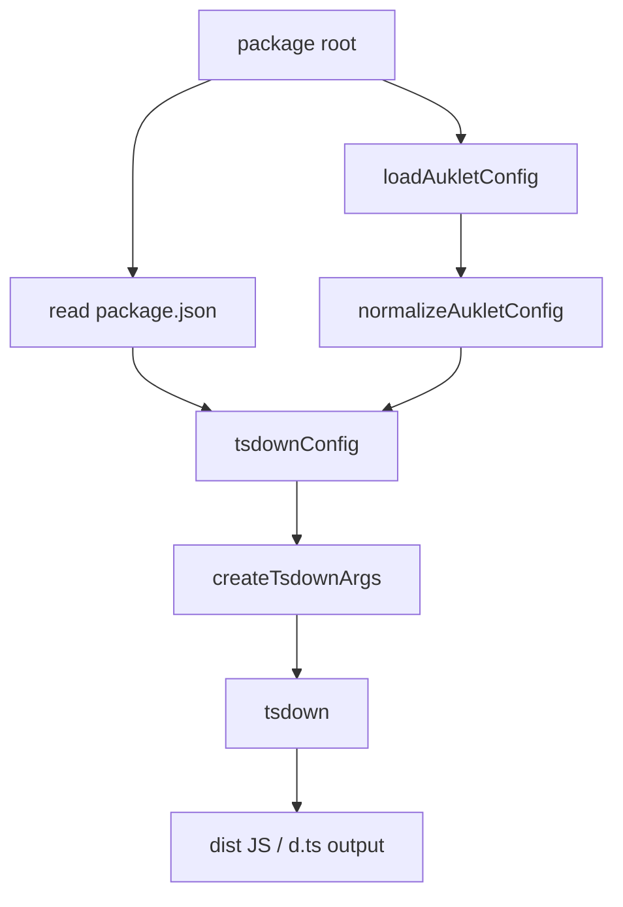
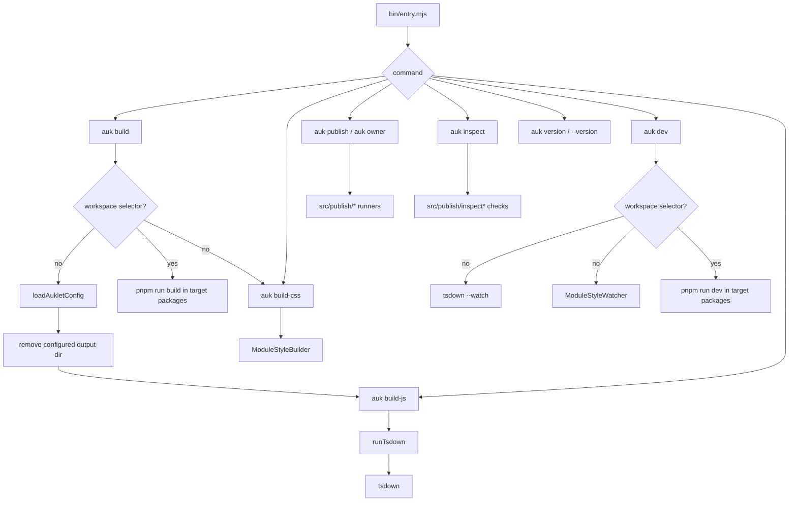

# Architecture Guide

This document describes auklet's current module boundaries and build flows.
Keep `CONTRIBUTING.md` as the contributor entry point; put architectural details
here when they are useful for maintainers.

## Project Scope

auklet is a build tool for TypeScript packages. It provides two main capability
areas:

- JavaScript/TypeScript builds: generate bundle, global, and module output based
  on `tsdown`.
- Style builds: generate package CSS, module CSS, theme CSS, external CSS, and
  virtual CSS entries for Vite dev mode.

This repository itself is a single-package project. `examples/` contains real
project-shape demos for debugging and testing both monorepo and single-package
scenarios.

## Repository Layout

```text
.
├── bin/                  # CLI entry, exposed as auk / auklet after publishing
├── src/                  # Tool source
├── docs/                 # Maintainer documentation
├── examples/             # Real demos and example-level tests
├── README.md             # User-facing documentation
├── package.json          # Package metadata, scripts, exports/imports
└── tsconfig.json         # TypeScript config for this package
```

## Source Modules

```text
src/
├── index.ts              # Public API exports
├── types.ts              # User config, internal config, and build context types
├── config.ts             # Defaults and config normalization
├── configLoader.ts       # Loads auklet.config.js / auklet.config.mjs
├── env.ts                # Loads .env files and resolves env-backed CLI values
├── cli/                  # CLI command registration and command runners
├── utils.ts              # Shared path and file utilities
├── workspace/            # Shared pnpm workspace discovery helpers
├── build/                # JavaScript build flow
├── css/                  # Style build flow
└── publish/              # Publish and owner workflows
```

## Config Modules

- `types.ts` defines `AukletConfig`, `NormalizedAukletConfig`,
  `PackageBuildOptions`, `ModuleStyleBuildConfig`, and related types.
- `config.ts` defines defaults and normalizes user config into a stable internal
  shape.
- `configLoader.ts` loads `auklet.config.js` or `auklet.config.mjs` from a
  package root. It supports cache busting for watch mode and does not transpile
  TypeScript config files.

Config invariants live in `docs/invariants.md`. Keep this section focused on
where config modules are and how the build flow uses them.

## Workspace Modules

```text
src/workspace/
├── packages.ts           # Reads and validates pnpm workspace package info
├── root.ts               # Finds pnpm workspace roots
└── targets.ts            # Shared filtered target selection and dependency sorting
```

Workspace discovery invariants live in `docs/invariants.md`. This module is
shared by CSS dev package sources, workspace build/dev target resolution, and
publish target resolution.

## JavaScript Build Modules

```text
src/build/
├── bundleConfig.ts       # Bundle format config
├── cleanOutput.ts        # Cleans output directory for auk build
├── moduleConfig.ts       # Unbundled module config
├── runTsdown.ts          # CLI/API entry for running tsdown
├── tsdownConfig.ts       # Compatibility entry forwarding to tsdown/define
└── tsdown/               # Generates tsdown config from auklet config and package.json
    ├── define.ts         # Public defineKernelPackageConfig* entry
    ├── context.ts        # Reads package.json and creates build context
    ├── dependencies.ts   # external, alwaysBundle, globals, and module id parsing rules
    ├── entries.ts        # Bundle/module entry collection
    ├── common.ts         # Shared tsdown config and user callback handling
    └── types.ts          # Internal build config types
```

`runTsdown` is the execution layer. It builds command arguments and invokes
tsdown. `cleanOutput` only serves `auk build`; it removes the current package's
configured `output` directory. `tsdownConfig` maps auklet `build` options to
tsdown config.

Build CLI overrides are parsed in `src/cli/parse/build.ts`. Top-level flags
such as `--source`, `--output`, `--modules`, and namespaced flags such as
`--build.formats`, `--build.target`, `--build.platform`, and
`--build.tsconfig` override auklet config files for the current command. The JS
build path passes those overrides to the tsdown child process through
`AUKLET_CONFIG_OVERRIDES`, which is read by the built-in auklet tsdown config.
Do not combine these flags with tsdown `--config`, `-c`, or `--no-config`; a
custom tsdown config owns its own config loading behavior.

Workspace selectors for build/dev are parsed in `src/cli/parse/workspace.ts`.
`--filter` and `--workspace` select packages by package name, `--deps` includes
workspace dependencies, and `--private` opts into private workspace packages.
Without `--private`, build/dev workspace commands skip private packages and
always exclude the workspace root package.

## CLI Modules

```text
src/cli/
├── main.ts               # Command registration and top-level error boundary
├── build.ts              # build/build-js command orchestration
├── buildCss.ts           # build-css command orchestration and watch lifecycle
├── buildWorkspace.ts     # filtered workspace build/dev target selection
├── dev.ts                # dev command process orchestration
├── inspect.ts            # inspect subcommand dispatch
└── parse/                # command argv parsing and CLI value resolution
    ├── core.ts           # Shared parser helpers
    ├── values.ts         # env-backed and deferred CLI values
    ├── workspace.ts      # --filter / --workspace / --deps / --private
    ├── build.ts          # build and build-js command options
    ├── dev.ts            # dev command options
    ├── publish.ts        # publish command options
    └── owner.ts          # owner command options
```

`bin/entry.mjs` should stay a bootstrap file that imports the built public API.
`src/cli/main.ts` owns command registration, while command-specific business
logic should live in the dedicated runner files above. Publish and owner CLI
glue lives in `src/publish/cli.ts`, while argument parsing lives in
`src/cli/parse/publish.ts` and `src/cli/parse/owner.ts`. Environment loading is
owned by `src/env.ts`. String and boolean CLI values that support `env:NAME`
should resolve through `src/cli/parse/values.ts`; target-scoped values such as
publish tokens should use deferred CLI values and resolve against the target
package's `AukletEnvContext`.

## Build Flow



Key rules:

- `build.target` defaults to `es2020`.
- `build.platform` defaults to `neutral`.
- `build.tsconfig` defaults to the nearest `tsconfig.json` found by walking
  upward from the package root.
- `dependencies`, `peerDependencies`, and `build.externals` are sources for
  externals.
- `build.alias` is passed through to tsdown `alias` and applies to bundle and
  module output.
- `build.globals` is merged into IIFE `output.globals` and overrides global
  names inferred from external package names.
- `build.mainFields` is passed to rolldown `resolve.mainFields` through tsdown
  `inputOptions` for bundle output. When omitted, only IIFE bundles get the
  default `['browser', 'module', 'main']`.
- `build.configureTsdown` is the final tsdown config hook.

## CLI Flow



## Examples

```text
examples/
├── monorepo-package/ # Component library monorepo demo
├── monorepo-lib/     # Pure lib monorepo demo
├── single-package/   # Single-package component library demo with Vite dev mode
├── single-lib/       # Single-package pure TypeScript lib demo
└── __tests__/        # Example output tests
```

Examples cover real usage scenarios. Root `pnpm build:examples` builds packages
under examples. `pnpm test:examples` builds examples first and then runs example
tests. `pnpm dev:examples` starts demos that expose a dev script for manual
checks.
