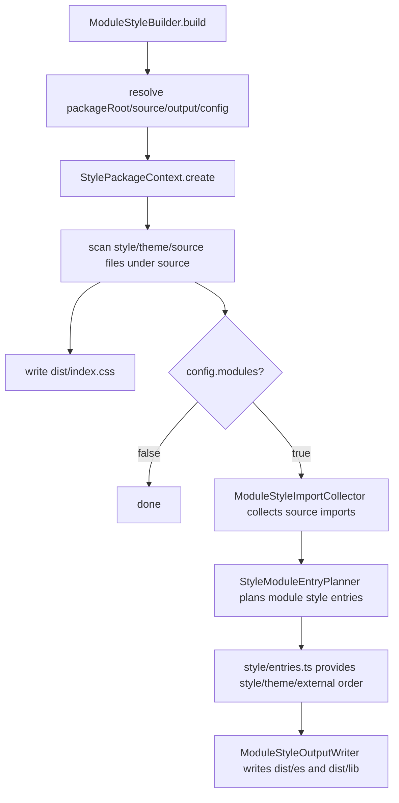
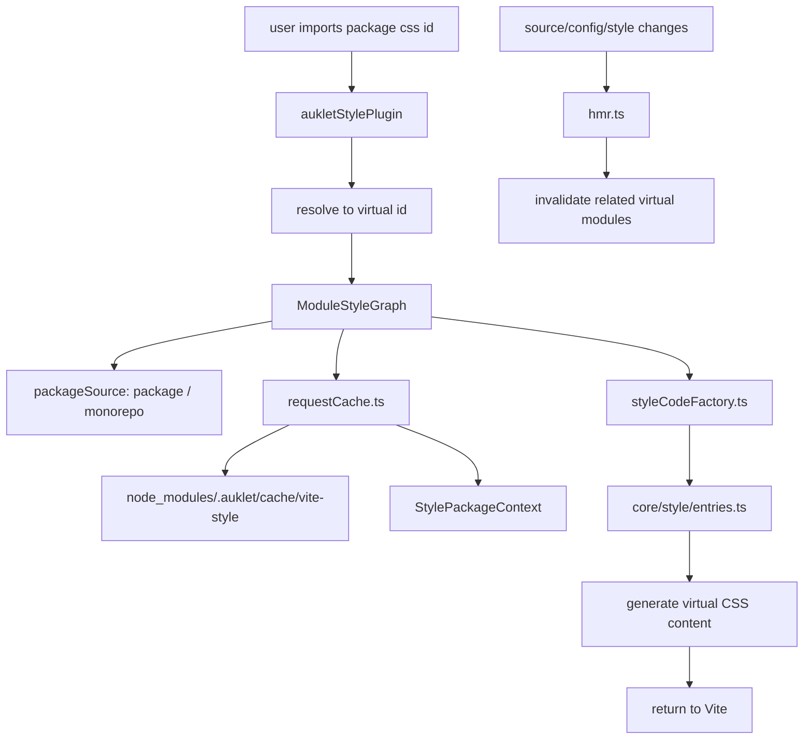

# CSS Guide

This document describes auklet's CSS module boundaries and capability limits.
auklet's CSS subsystem is a rule-based style entry generator, not a full CSS
bundler or a replacement for Vite/PostCSS.

## Naming Conventions

Use `Style` for internal style build concepts, such as `ModuleStyleBuilder`,
`ModuleStyleGraph`, and `PackageStyleEntryWriter`. This keeps core abstractions
stable if auklet later supports other style languages such as Less.

Keep `css` only where the API or artifact is explicitly CSS-oriented:

- Directory name: `src/css/`, because the current module still handles CSS
  output.
- CLI command: `auk build-css`, because the user-facing command should stay
  obvious.
- File names and import ids: `style.css`, `module.css`, `external.css`,
  `auklet-css:*`.
- Log prefix: `[css]`.

## Source Modules

```text
src/css/
├── config.ts                     # Default CSS output structure config
├── constants.ts                  # CSS/source file matching constants
├── inspect.ts                    # Read-only CSS plan inspection
└── core/
    ├── stylePackageContext.ts        # Collects style build context for one package
    ├── styleProcessor.ts             # Reads, merges, and expands style content
    ├── workspaceStyleResolver.ts     # Resolves workspace/package/node_modules style deps
    ├── styleImports/                 # Infers style deps from TSX imports/re-exports
    ├── resolvers/                    # Same-package source import candidate resolvers
    ├── styleModuleEntryPlanner.ts    # Plans module-level style entries
    └── style/                        # Entry and dependency semantics
```

Key modules:

- `StylePackageContext`: aggregates package root, source/output directories,
  theme files, style files, resolver, and processor.
- `StyleProcessor`: reads CSS files, expands local `@import`, and merges PostCSS
  roots.
- `WorkspaceStyleResolver`: resolves style dependencies from config to real
  files or output paths.
- `styleImports/collector.ts`: scans `.tsx` source files and infers module-level
  style imports from imports, named re-exports, and configured component rules.
- `resolvers/`: turns source import specifiers into candidate relative paths
  inside the current package source tree.
- `style/entries.ts`: environment-neutral style graph entry semantics consumed
  by production writers and Vite/dev renderers.
- `inspect.ts`: builds the read-only `auk inspect css` model from the same
  package context and entry planner used by production CSS output. When invoked
  from a pnpm workspace root, it inspects workspace child packages and filters
  out the root package. It does not build CSS, so dependency package CSS outputs
  must already exist for external style entries and component auto imports to be
  represented accurately.

## Production Modules

```text
src/css/production/
├── builder.ts                       # CSS build entry
├── packageEntryWriter.ts           # Writes package-level dist/index.css
├── moduleOutputWriter.ts            # Orchestrates modular CSS output under dist/es and dist/lib
└── format/
    ├── sourceWriter.ts              # Copies source style files
    ├── entryWriter.ts               # Writes style/index.css
    ├── moduleWriter.ts              # Writes style/module.css
    ├── externalWriter.ts            # Writes style/external.css
    ├── themeWriter.ts               # Writes style/themes and theme entries
    ├── moduleEntryWriter.ts         # Writes module-level style/index.css
    └── shared.ts                    # Shared types and path helpers
```

Production modules should not reimplement dev graph entry semantics. Entry
composition order should come from `src/css/core/style/entries.ts`.

## Dev/Vite Modules

```text
src/css/vite/
├── vitePlugin.ts        # Vite plugin entry
├── hmr.ts               # Style-related HMR checks and updates
└── moduleGraph/         # Vite/dev virtual CSS graph
    ├── graph.ts
    ├── styleCodeFactory.ts
    ├── requestCache.ts
    ├── devDependency.ts
    ├── loadResult.ts
    ├── persistentCache.ts
    ├── styleId.ts
    └── packageSource/
        ├── monorepo.ts
        ├── singlePackage.ts
        └── types.ts
```

The Vite plugin turns package CSS imports into virtual modules and calls
`moduleGraph/` to generate CSS. HMR logic decides which virtual CSS modules to
invalidate when source, config, or style files change. Tracked style files use
auklet's own js-update path so dependency packages can refresh their virtual
CSS without a full reload; CSS files outside the tracked style graph stay on
Vite's native CSS HMR.

Vite/dev caches virtual CSS generation in memory for the current dev server
lifecycle and persists generated virtual CSS results under
`node_modules/.auklet/cache/vite-style/`. This cache is a local development
optimization only. Production CSS builds do not read from or write to it, and it
can be deleted safely; the next Vite dev run will regenerate missing entries.
The cache records direct inputs such as source/style files, direct config files,
`tsconfig.json`, and package `package.json` files that affect package
resolution. In monorepo mode, the cache key also includes workspace package
names and roots, and `pnpm-workspace.yaml` is tracked as a cache input. Config
helper modules imported by config files are not tracked.
When those helper modules or other config dependencies change without changing
the direct config file, delete `node_modules/.auklet/cache` and restart the dev
server to force regeneration.
Cache files are best-effort cleaned after writes: entries older than 7 days are
removed, and the current cache version directory is capped at 5000 JSON files.
Empty virtual CSS results are not persisted.

`moduleGraph/packageSource/monorepo.ts` reads pnpm workspace packages, filters
out the workspace root package, and surfaces workspace read failures instead of
silently treating the workspace as empty.

## Supported Model

auklet supports this user model:

- package style entry: package-level aggregate CSS such as `dist/index.css`;
- module style entry: per-source-module CSS such as
  `dist/es/components/Button/style/index.css`;
- theme style entry: configured theme files and their dependency themes;
- external style entry: configured third-party or workspace package style
  dependencies;
- Vite dev virtual entries for the same package/module/theme/external model.

The supported input surface is intentionally narrow:

- Source style files are regular CSS files discovered under the configured
  source root.
- Current package theme entries come from `styles.themes`.
- Controlled same-package shared CSS fragments come from `styles.shared`.
  Matched files must be under the current package source root. Component CSS may
  import them directly, and generated component CSS inlines them so single
  component CSS remains self-contained. Shared patterns support a small glob
  subset: `*`, `**`, and `?`.
- External package style entries, theme entries, and component auto-import rules
  come from `styles.dependencies`.
- `auk inspect css` is read-only. It can explain the current package plan before
  building that package, but dependency packages should be built first when their
  CSS outputs are part of the plan.
- Module auto imports are inferred from `.tsx` imports and named re-exports.
  `.ts`, `.d.ts`, and `export * from` are outside the inference model.
- Same-package source specifiers may resolve through relative paths,
  `package.json#imports`, or `tsconfig.compilerOptions.paths`, but resolved
  files must stay inside the current package source root.

## Import Semantics

`StyleProcessor` expands local CSS `@import` rules so generated entries can
merge source styles and avoid duplicate content. Treat this as source-file
composition, not as full CSS bundling.

Supported import behavior:

- local relative CSS imports inside source style files;
- local relative CSS imports should stay inside the same component/module
  directory. Importing another component's CSS from component CSS is rejected;
  express component reuse through TSX imports so auklet can infer module CSS
  dependencies.
- component CSS may import local CSS outside its component/module directory only
  when the imported file is under the current source root and matches
  `styles.shared`;
- CSS imports inside a shared fragment are recursively inlined when they resolve
  to non-module, non-theme helper CSS under the current source root, so nested
  shared fragments stay self-contained in component CSS output without bypassing
  component or theme boundaries;
- recursive local imports with circular import protection;
- duplicate local import/content suppression for generated output stability;
- generated `@import` paths between auklet output entries, produced by
  `style/entries.ts` and the production/dev writers.

Out of scope:

- URL rebasing for `url(...)`;
- CSS Modules class name transformation;
- Sass/Less/Stylus or other preprocessors;
- minification, autoprefixing, nesting transforms, or other PostCSS plugin
  behavior;
- arbitrary package CSS bundling beyond configured style dependencies;
- semantic handling of conditional CSS imports such as media, supports, or
  layer-specific import conditions.

## Production And Dev Alignment

Production output and Vite dev virtual CSS must share the same entry semantics:

- entry composition order lives in `src/css/core/style/entries.ts`;
- production writers should not invent ordering that the Vite graph cannot
  reproduce;
- Vite graph code should not accept package/style ids that production output
  cannot represent;
- third-party CSS dependencies in dev should keep resolving from the package
  root that declares them, usually through Vite `/@fs/...` imports;
- workspace package style dependencies in dev should stay virtual and recursive
  so HMR can track source changes across packages.

When changing CSS behavior, update both production and dev paths or explicitly
document why the behavior is production-only or dev-only. Broad semantic changes
usually need project-level tests that compare normalized production output and
Vite/dev graph output.

## Production Build Flow



Output semantics:

- `dist/index.css`: package-level aggregate CSS for direct package style imports.
- `dist/{es,lib}/style/index.css`: style entry for the current format.
- `dist/{es,lib}/style/module.css`: module style collection for the current
  package.
- `dist/{es,lib}/style/external.css`: external style entry.
- `dist/{es,lib}/themes/*.css`: theme entries including theme dependencies and
  current theme files.
- `dist/{es,lib}/components/*/style/index.css`: module-level style entry.

## Dev/Vite Flow



The dev flow does not write real output. It generates virtual CSS content and
shares `core/style/entries.ts` with production writers.
