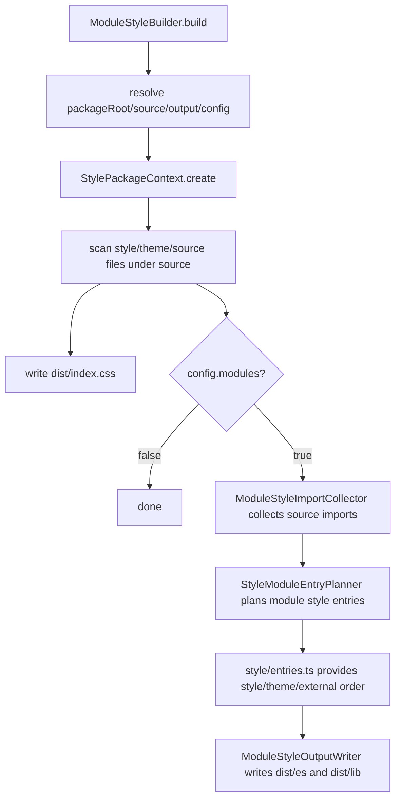
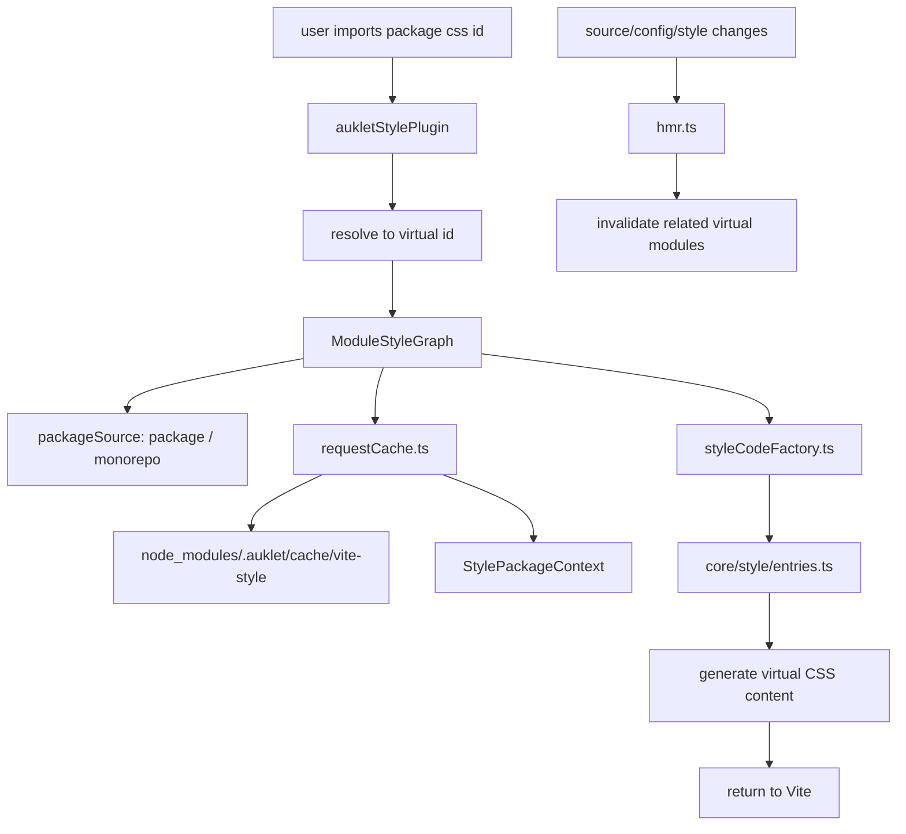

# CSS Guide

This document describes auklet's CSS module boundaries and capability limits.
auklet's CSS subsystem is a rule-based style entry generator, not a full CSS
bundler or a replacement for Vite/PostCSS.

## Naming Conventions

Use `Style` for internal style build concepts, such as `ModuleStyleBuilder`,
`ModuleStyleGraph`, and `PackageStyleEntryWriter`. Source languages may be CSS
or Less; published and virtual artifacts remain CSS.

Keep `css` only where the API or artifact is explicitly CSS-oriented:

- Directory name: `src/css/`, because the current module still handles CSS
  output.
- CLI command: `auk build-css`, because the user-facing command should stay
  obvious.
- File names and import ids: `style.css`, `module.css`, `external.css`,
  `auklet-css:*`.
- Log prefix: `[css]`.

## Source Modules

```text
src/css/
├── config.ts                     # Default CSS output structure config
├── constants.ts                  # CSS/source file matching constants
├── inspect.ts                    # Read-only CSS plan inspection
└── core/
    ├── stylePackageContext.ts        # Collects style build context for one package
    ├── styleProcessor.ts             # Reads, merges, and expands style content
    ├── lessCompiler.ts               # Compiles `.less` sources to CSS
    ├── prefixSelectors.ts            # Applies `styles.prefix` to PostCSS roots
    ├── workspaceStyleResolver.ts     # Resolves workspace/package/node_modules style deps
    ├── styleImports/                 # Infers style deps from TSX imports/re-exports
    ├── resolvers/                    # Same-package source import candidate resolvers
    ├── styleModuleEntryPlanner.ts    # Plans module-level style entries
    └── style/                        # Entry and dependency semantics
```

Key modules:

- `StylePackageContext`: aggregates package root, source/output directories,
  theme files, style files, resolver, and processor.
- `StyleProcessor`: loads `.css` / `.less` (Less compiles on disk read), expands
  local `@import` when needed, applies `styles.prefix`, and merges PostCSS roots.
- `lessCompiler.ts` / `prefixSelectors.ts`: the only allowed style transforms;
  called from `StyleProcessor`, not from production writers.
- `WorkspaceStyleResolver`: resolves style dependencies from config to real
  files or output paths.
- `styleImports/collector.ts`: scans `.tsx` source files and infers module-level
  style imports from imports, named re-exports, and configured component rules.
- `resolvers/`: turns source import specifiers into candidate relative paths
  inside the current package source tree.
- `style/entries.ts`: environment-neutral style graph entry semantics consumed
  by production writers and Vite/dev renderers.
- `inspect.ts`: builds the read-only `auk inspect css` model from the same
  package context and entry planner used by production CSS output. When invoked
  from a pnpm workspace root, it inspects workspace child packages and filters
  out the root package. It does not build CSS, so dependency package CSS outputs
  must already exist for external style entries and component auto imports to be
  represented accurately.

## Production Modules

```text
src/css/production/
├── builder.ts                       # CSS build entry
├── packageEntryWriter.ts           # Writes package-level dist/index.css
├── moduleOutputWriter.ts            # Orchestrates modular CSS output under dist/es and dist/lib
└── format/
    ├── sourceWriter.ts              # Copies source style files
    ├── entryWriter.ts               # Writes style/index.css
    ├── moduleWriter.ts              # Writes style/module.css
    ├── externalWriter.ts            # Writes style/external.css
    ├── themeWriter.ts               # Writes style/themes and theme entries
    ├── moduleEntryWriter.ts         # Writes module-level style/index.css
    └── shared.ts                    # Shared types and path helpers
```

Production modules should not reimplement dev graph entry semantics. Entry
composition order should come from `src/css/core/style/entries.ts`.

## Dev/Vite Modules

```text
src/css/vite/
├── vitePlugin.ts        # Vite plugin entry
├── hmr.ts               # Style-related HMR checks and updates
└── moduleGraph/         # Vite/dev virtual CSS graph
    ├── graph.ts
    ├── styleCodeFactory.ts
    ├── requestCache.ts
    ├── devDependency.ts
    ├── loadResult.ts
    ├── persistentCache.ts
    ├── styleId.ts
    └── packageSource/
        ├── monorepo.ts
        ├── singlePackage.ts
        └── types.ts
```

The Vite plugin turns package CSS imports into virtual modules and calls
`moduleGraph/` to generate CSS. HMR logic decides which virtual CSS modules to
invalidate when source, config, or style files change. Tracked style files use
auklet's own js-update path so dependency packages can refresh their virtual
CSS without a full reload; CSS files outside the tracked style graph stay on
Vite's native CSS HMR.

Vite/dev caches virtual CSS generation in memory for the current dev server
lifecycle and persists generated virtual CSS results under
`node_modules/.auklet/cache/vite-style/`. This cache is a local development
optimization only. Production CSS builds do not read from or write to it, and it
can be deleted safely; the next Vite dev run will regenerate missing entries.
The cache records direct inputs such as source/style files, direct config files,
`tsconfig.json`, and package `package.json` files that affect package
resolution. In monorepo mode, the cache key also includes workspace package
names and roots, and `pnpm-workspace.yaml` is tracked as a cache input. Config
helper modules imported by config files are not tracked.
When those helper modules or other config dependencies change without changing
the direct config file, delete `node_modules/.auklet/cache` and restart the dev
server to force regeneration.
Cache files are best-effort cleaned after writes: entries older than 7 days are
removed, and the current cache version directory is capped at 5000 JSON files.
Empty virtual CSS results are not persisted.

`moduleGraph/packageSource/monorepo.ts` reads pnpm workspace packages, filters
out the workspace root package, and surfaces workspace read failures instead of
silently treating the workspace as empty.

## Supported Model

auklet supports this user model:

- package style entry: package-level aggregate CSS such as `dist/index.css`;
- module style entry: per-source-module CSS such as
  `dist/es/components/Button/style/index.css`;
- theme style entry: configured theme files and their dependency themes;
- external style entry: configured third-party or workspace package style
  dependencies;
- Vite dev virtual entries for the same package/module/theme/external model.

The supported input surface is intentionally narrow:

- Source style files are `.css` or `.less` under the configured source root.
  Outputs and Vite virtual modules are always CSS (`.less` → `.css`).
- `styles.prefix` wraps selectors on the current package's own style rules
  (host must provide the matching container for `:root` / `html` / `body`).
- Current package theme entries come from `styles.themes` (may point at `.less`).
- Controlled same-package shared fragments come from `styles.shared` under the
  source root. Prefer `.css` shared when the `@import` edge must be preserved;
  Less→Less shared is inlined by Less. Shared patterns support `*`, `**`, `?`.
- External package style entries come from `styles.dependencies` and always
  reference the dependency's built CSS (not its Less sources).
- `auk inspect css` is read-only; dependency CSS outputs should already exist.
- Module auto imports are inferred from `.tsx` named imports/re-exports only.
- Same-package source specifiers may use relative paths, `package.json#imports`,
  or `tsconfig` paths, and must stay inside the current package source root.

## Import Semantics

Generated CSS preserves local source `@import` rules whenever the output has a
real file or virtual entry that can represent the relationship. `StyleProcessor`
still expands imports for full aggregate package output, while production
format/module output and component-level Vite/dev entries prefer an import graph
over duplicated rules. Treat this as source-file composition, not as full CSS
bundling.

Cross-language `@import`:

- `.less` → `.less`: Less inlines; `less.render` `imports` mark partials (no
  separate module entry) and enforce the same component-local / `styles.shared`
  rules as CSS.
- `.less` → `.css`: allowed; remaining CSS `@import` uses the existing graph.
  Less may rewrite `./file.css` to `file.css`; auklet recovers same-directory
  style files so the graph still treats them as local imports.
- `.css` → `.less`: rejected.
- Do not use `@import (less)` on `.css` files.

Supported import behavior (after Less compile when applicable):

- local relative style imports; also `package.json#imports` /
  `tsconfig.compilerOptions.paths` to files under the source root. Production
  copies rewrite aliases to relative `.css` output paths;
- unresolved relative / `#...` source-local imports fail (no package fallback);
- imports must stay inside the source root; theme files follow the same rule;
- component style imports stay in the same component/module directory, except
  `styles.shared`; cross-component reuse goes through TSX imports;
- shared fragments may import non-module, non-theme helpers under the source
  root and keep those `@import`s when the shared file is CSS;
- circular local CSS `@import`s are rejected; duplicate import/content is
  suppressed; rewritten imports keep media/supports/layer tails;
- generated `@import`s between auklet entries come from `style/entries.ts`.

Vite/dev: virtual CSS never emits `/@fs/**/*.less` (including module entry
lists). `.less` sources are compiled in the processor; watch/HMR still tracks
`.less` and Less `imports`. When `styles.prefix` is set, own-package CSS entries
and preserved same-package imports also go through `StyleProcessor` (not raw
`/@fs`) so selector prefixing matches production copies. Dependency CSS is never
prefixed.

Graph shape caveat with `styles.prefix`: production still preserves `@import`
edges to already-prefixed copies (`SourceStyleFileWriter` does not expand).
Vite inlines those same-package CSS imports while prefixing so virtual modules
cannot point at raw `/@fs` sources. Selector prefixes stay aligned; the import
graph may differ (Vite flattens; production keeps `@import`, which bundlers can
dedupe by URL). Without `styles.prefix`, Vite keeps the `/@fs` preserve path for
own `.css` files.

Out of scope:

- URL rebasing for `url(...)`;
- CSS Modules / `:global`;
- Sass/Stylus or other preprocessors beyond Less;
- general PostCSS plugin pipelines (only Less compile + `styles.prefix`);
- compiling dependency / `node_modules` Less sources;
- arbitrary package CSS bundling beyond configured style dependencies;
- interpreting conditional CSS import semantics during aggregate expansion.

## Production And Dev Alignment

Production output and Vite dev virtual CSS must share the same entry semantics:

- entry composition order lives in `src/css/core/style/entries.ts`;
- production writers should not invent ordering that the Vite graph cannot
  reproduce;
- Vite graph code should not accept package/style ids that production output
  cannot represent;
- third-party CSS dependencies in dev should keep resolving from the package
  root that declares them, usually through Vite `/@fs/...` imports;
- workspace package style dependencies in dev should stay virtual and recursive
  so HMR can track source changes across packages;
- Less compile and `styles.prefix` must stay aligned for selectors; when
  `styles.prefix` is on, Vite may flatten same-package CSS `@import`s while
  production keeps the `@import` graph (see Import Semantics above).

When changing CSS behavior, update both production and dev paths or explicitly
document why the behavior is production-only or dev-only. Broad semantic changes
usually need project-level tests that compare normalized production output and
Vite/dev graph output.

## Production Build Flow


```mermaid
flowchart TD
  Start["ModuleStyleBuilder.build"] --> ResolveContext["resolve packageRoot/source/output/config"]
  ResolveContext --> PackageContext["StylePackageContext.create"]
  PackageContext --> Scan["scan style/theme/source files under source"]
  Scan --> PackageStyle["write dist/index.css"]
  Scan --> Modules{"config.modules?"}
  Modules -->|false| Done["done"]
  Modules -->|true| ModuleImports["ModuleStyleImportCollector collects source imports"]
  ModuleImports --> EntryPlan["StyleModuleEntryPlanner plans module style entries"]
  EntryPlan --> SharedGraph["style/entries.ts provides style/theme/external order"]
  SharedGraph --> Writer["ModuleStyleOutputWriter writes dist/es and dist/lib"]
```

Output semantics:

- `dist/index.css`: package-level aggregate CSS for direct package style imports.
  It remains a full aggregate file even when module output is enabled, so
  package-level CSS imports work without requiring a downstream CSS graph.
- `dist/{es,lib}/style/index.css`: style entry for the current format.
- `dist/{es,lib}/style/module.css`: module style collection for the current
  package. It imports source-level CSS entry files instead of flattening their
  rules.
- `dist/{es,lib}/style/external.css`: external style entry.
- `dist/{es,lib}/themes/*.css`: theme entries including theme dependencies and
  current theme files.
- `dist/{es,lib}/components/*/style/index.css`: module-level style entry.
  Source CSS subpaths such as `dist/es/components/Button/index.css` are entry
  files with their own imports preserved; they are not independent complete
  style copies.

## Dev/Vite Flow


```mermaid
flowchart TD
  Import["user imports package css id"] --> Plugin["aukletStylePlugin"]
  Plugin --> ResolveId["resolve to virtual id"]
  ResolveId --> Graph["ModuleStyleGraph"]
  Graph --> Source["packageSource: package / monorepo"]
  Graph --> Cache["requestCache.ts"]
  Cache --> DiskCache["node_modules/.auklet/cache/vite-style"]
  Cache --> PackageContext["StylePackageContext"]
  Graph --> Factory["styleCodeFactory.ts"]
  Factory --> SharedGraph["core/style/entries.ts"]
  SharedGraph --> LoadStyle["generate virtual CSS content"]
  LoadStyle --> Vite["return to Vite"]
  FileChange["source/config/style changes"] --> Hmr["hmr.ts"]
  Hmr --> Invalidate["invalidate related virtual modules"]
```

The dev flow does not write real output. It generates virtual CSS content and
shares `core/style/entries.ts` with production writers.
