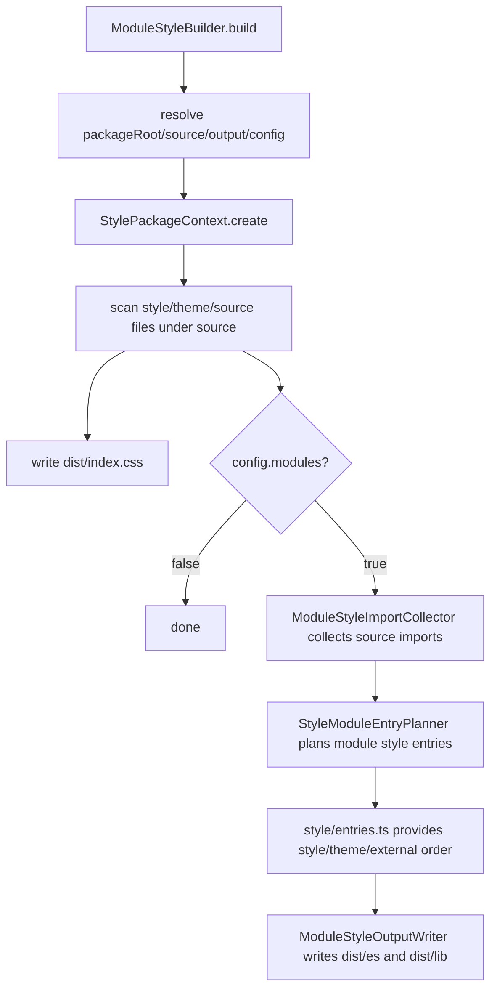
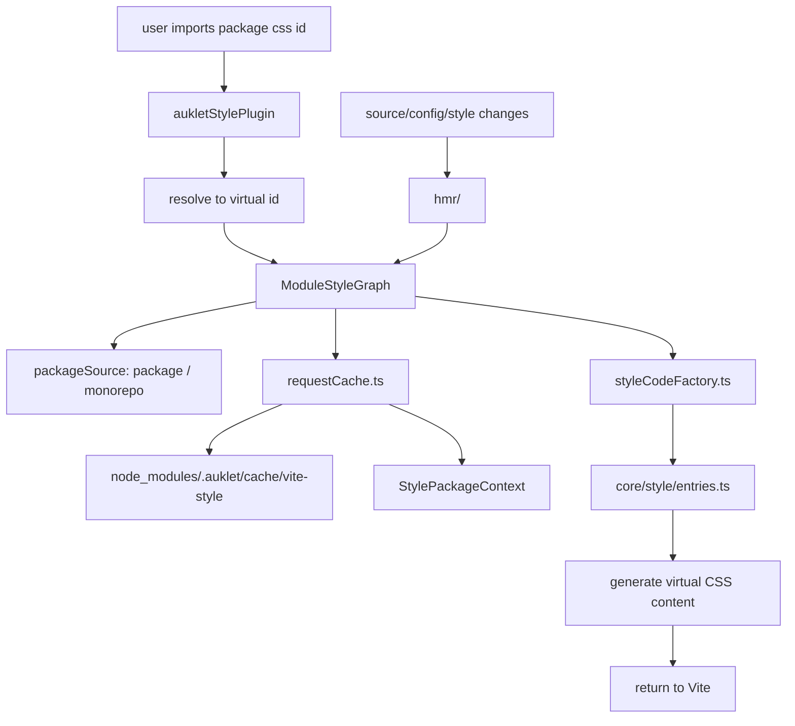

# CSS Guide

This document describes auklet's CSS module boundaries and capability limits.
auklet's CSS subsystem is a rule-based style entry generator, not a full CSS
bundler or a replacement for Vite/PostCSS.

## Naming Conventions

Use `Style` for internal style build concepts, such as `ModuleStyleBuilder`,
`ModuleStyleGraph`, and `PackageStyleEntryWriter`. Source languages may be CSS
or Less; published and virtual artifacts remain CSS.

Keep `css` only where the API or artifact is explicitly CSS-oriented:

- Directory name: `src/css/`, because the current module still handles CSS
  output.
- CLI command: `auk build-css`, because the user-facing command should stay
  obvious.
- File names and import ids: `style.css`, `module.css`, `external.css`,
  `auklet-css:*`.
- Log prefix: `[css]`.

## Source Modules

```text
src/css/
├── config.ts                     # Default CSS output structure config
├── constants.ts                  # CSS/source file matching constants
├── inspect.ts                    # Read-only CSS plan inspection
├── modules/                      # CSS Modules protocol (independent of global entries)
└── core/
    ├── stylePackageContext.ts        # Collects style build context for one package
    ├── styleProcessor.ts             # Reads, merges, and expands style content
    ├── lessCompiler.ts               # Compiles `.less` sources to CSS
    ├── lessImportGraph.ts            # Scans Less/@import via postcss-less
    ├── externalLessGraph.ts          # Shared external Less reference graph
    ├── packageStyleSource.ts         # Plain package style: resolve → CSS text
    ├── prefixSelectors.ts            # Applies `styles.prefix` to PostCSS roots
    ├── workspaceStyleResolver.ts     # Resolves workspace/package/node_modules style deps
    ├── styleImports/                 # Infers style deps from TSX imports/re-exports
    ├── resolvers/
    │   ├── packageDependency.ts      # Shared dep/package.json resolve helpers
    │   ├── externalLess.ts           # package.json#exports Less reference resolver
    │   ├── externalPackageStyle.ts   # package style exports resolver
    │   └── ...                       # Same-package source import candidate resolvers
    ├── styleModuleEntryPlanner.ts    # Plans module-level style entries
    └── style/                        # Entry and dependency semantics
```

Key modules:

- `StylePackageContext`: aggregates package root, source/output directories,
  theme files, style files, resolver, and processor. Excludes `*.module.css` /
  `*.module.less` from the global `styleFiles` list.
- `StyleProcessor`: loads `.css` / `.less` (Less compiles on disk read), expands
  local `@import` when needed, applies `styles.prefix`, and merges PostCSS roots.
  Rejects CSS Modules files; those use `src/css/modules` instead.
- `lessCompiler.ts` / `prefixSelectors.ts`: global style transforms called from
  `StyleProcessor`, not from production writers. `lessCompiler` is also reused as
  a leaf by the CSS Modules protocol.
- `packageStyleSource.ts`: shared plain-package style helper (`resolve` → CSS
  text, including Less compile). Used by build `packageStyleImportPlugin` and
  Vite package-style resolve/load; each glue keeps its own virtual ids / emit.
- `modules/`: CSS Modules protocol (`compileCssModule` → `{ css, locals,
watchFiles }`). JS build and Vite call this API; the global entry pipeline does
  not.
- `WorkspaceStyleResolver`: resolves style dependencies from config to real
  files or output paths.
- `styleImports/collector.ts`: scans `.tsx` source files and infers module-level
  style imports from imports, named re-exports, and configured component rules.
- `resolvers/`: turns source import specifiers into candidate relative paths
  inside the current package source tree.
- `style/entries.ts`: environment-neutral style graph entry semantics consumed
  by production writers and Vite/dev renderers.
- `inspect.ts`: builds the `auk inspect css` model from the same package context
  and entry planner used by production CSS output. When invoked from a pnpm
  workspace root, it inspects workspace child packages and filters out the root
  package. It does not build CSS, so dependency package CSS outputs must already
  exist for external style entries and component auto imports to be represented
  accurately. For `styles.shared.output`, it also validates `package.json#exports`
  (subpath → published JS shim via `exportSubpath` / `./...`) and dist JS/CSS
  presence, and exits `1` when those checks fail.

## Production Modules

```text
src/css/production/
├── builder.ts                       # CSS build entry
├── packageEntryWriter.ts           # Writes package-level dist/index.css
├── moduleOutputWriter.ts            # Orchestrates modular CSS output under dist/es and dist/lib
├── sharedOutputWriter.ts            # Compiles styles.shared.output → scoped.css + shim
└── format/
    ├── sourceWriter.ts              # Copies source style files
    ├── entryWriter.ts               # Writes style/index.css
    ├── moduleWriter.ts              # Writes style/module.css
    ├── externalWriter.ts            # Writes style/external.css
    ├── themeWriter.ts               # Writes style/themes and theme entries
    ├── moduleEntryWriter.ts         # Writes module-level style/index.css
    └── shared.ts                    # Shared types and path helpers
```

Production modules should not reimplement dev graph entry semantics. Entry
composition order should come from `src/css/core/style/entries.ts`.

## Dev/Vite Modules

```text
src/css/vite/
├── vitePlugin.ts        # Vite plugin entry
├── hmr/                 # Dev style HMR (package CSS + CSS Modules)
└── moduleGraph/         # Vite/dev virtual CSS graph
    ├── graph.ts
    ├── styleCodeFactory.ts
    ├── requestCache.ts
    ├── devDependency.ts
    ├── loadResult.ts
    ├── persistentCache.ts
    ├── styleId.ts
    └── packageSource/
        ├── monorepo.ts
        ├── singlePackage.ts
        └── types.ts
```

The Vite plugin resolves package CSS through virtual modules built by
`moduleGraph/`. On tracked source changes, `hmr/` refreshes affected package CSS
and CSS Modules; other CSS remains on Vite's native HMR.

Vite/dev caches virtual CSS generation in memory for the current dev server
lifecycle and persists generated virtual CSS results under
`node_modules/.auklet/cache/vite-style/`. This cache is a local development
optimization only. Production CSS builds do not read from or write to it, and it
can be deleted safely; the next Vite dev run will regenerate missing entries.
The cache records direct inputs such as source/style files, direct config files,
`tsconfig.json`, and package `package.json` files that affect package
resolution. In monorepo mode, the cache key also includes workspace package
names and roots, and `pnpm-workspace.yaml` is tracked as a cache input. Config
helper modules imported by config files are not tracked.
When those helper modules or other config dependencies change without changing
the direct config file, delete `node_modules/.auklet/cache` and restart the dev
server to force regeneration.
Cache files are best-effort cleaned after writes: entries older than 7 days are
removed, and the current cache version directory is capped at 5000 JSON files.
Empty virtual CSS results are not persisted.

`moduleGraph/packageSource/monorepo.ts` reads pnpm workspace packages, filters
out the workspace root package, and surfaces workspace read failures instead of
silently treating the workspace as empty.

## Supported Model

auklet supports this user model:

- package style entry: package-level aggregate CSS such as `dist/index.css`;
- module style entry: per-source-module CSS such as
  `dist/es/components/Button/style/index.css`;
- theme style entry: configured theme files and their dependency themes;
- external style entry: configured third-party or workspace package style
  dependencies;
- Vite dev virtual entries for the same package/module/theme/external model.

The supported input surface is intentionally narrow:

- Global source style files are `.css` or `.less` under the configured source
  root (excluding `*.module.css` / `*.module.less`). Outputs and Vite virtual
  modules for that pipeline are always CSS (`.less` → `.css`).
- CSS Modules sources are `*.module.css` / `*.module.less` and follow the
  Modules protocol above; they are not global style entries.
- `styles.prefix` wraps selectors for mount-point isolation (see table below).
  Host must provide the matching container for `:root` / `html` / `body`.
- Current package theme entries come from `styles.themes` (may point at `.less`).
- Controlled same-package shared fragments come from `styles.shared` under the
  source root. Prefer `.css` shared when the `@import` edge must be preserved;
  Less→Less shared is inlined by Less. Patterns are resolved with `fast-glob`.
  - object form only: `{ inner?, output? }` (string / `string[]` is rejected).
  - `inner`: same-package component-style `@import` allowlist for **plain**
    `.css` / `.less` only (not `*.module.*`). Prefix: see table below.
  - `output`: publishable shared styles — CSS Modules and/or plain `.css` /
    `.less`. Prefix: see table below (none of these kinds apply it).
    - Modules (`*.module.css` / `*.module.less`): require `modules: true`.
      Compile via `compileCssModule` into `{output}/es|lib` as `*.scoped.css` +
      JS locals shim. Cross-package sibling plain CSS assets land under
      `shared-package/<pkg>/...`. Cross-package `.less` in Modules must use
      `@import (reference)`.
    - Plain `.css` / `.less`: copy as-is to `{output}/es|lib/<sourceRelative>`
      (**Less is not compiled**, so tokens stay usable for
      `@import (reference)`). `modules: true` is not required when output has
      only plain files.
    - Directory prefixes of `output` globs stay out of package/module global
      `styleFiles`. Use `inner` if a plain file in that tree must also appear as
      a global shared fragment. Globs whose exclude root is the source root are
      rejected.

### `styles.prefix` rules

`styles.prefix` applies only to **this package's own** global-style rules. It
does not rewrite other packages' published CSS, and it does not run on CSS
Modules or any `styles.shared.output` kind.

| Style surface                                          | Applies this package's `styles.prefix`?                                               |
| ------------------------------------------------------ | ------------------------------------------------------------------------------------- |
| Own global source styles (component / package entries) | Yes                                                                                   |
| `styles.themes`                                        | Yes                                                                                   |
| `styles.shared.inner` (plain `.css` / `.less`)         | Yes                                                                                   |
| `styles.shared.output` — CSS Modules                   | No                                                                                    |
| `styles.shared.output` — plain `.css` / `.less`        | No                                                                                    |
| CSS Modules (`*.module.*`) anywhere                    | No                                                                                    |
| `styles.dependencies` / other-package built CSS        | No                                                                                    |
| External Less `@import (reference)` tokens / mixins    | No — tokens are not selectors; rules you write in **own** files follow the rows above |

Producer vs consumer: a package that publishes via `shared.output` ships
unprefixed assets. A consumer's `styles.prefix` still applies only to that
consumer's own rows in the table — it does **not** re-prefix the imported
dependency CSS.

- External package style entries come from `styles.dependencies` and always
  reference the dependency's built CSS (not its Less sources).
- `auk inspect css` plans CSS entries and **validates** `styles.shared.output`:
  Modules exports must target a JS shim under `{output}/es|lib`; plain css/less
  exports must target the mirrored asset under `{output}/es|lib`. Dist presence
  is checked; exit `1` when export or dist checks fail.
- Module auto imports are inferred from `.tsx` named imports/re-exports only.
- Same-package source specifiers may use relative paths, `package.json#imports`,
  or `tsconfig` paths, and must stay inside the current package source root.

## Import Semantics

Generated CSS preserves local source `@import` rules whenever the output has a
real file or virtual entry that can represent the relationship. `StyleProcessor`
still expands imports for full aggregate package output, while production
format/module output and component-level Vite/dev entries prefer an import graph
over duplicated rules. Treat this as source-file composition, not as full CSS
bundling.

Cross-language `@import`:

- `.less` → `.less`: production copies compile each Less file to `.css` and
  rewrite local Less partial imports to `@import "./partial.css"` instead of
  inlining partial rules into the importer copy. `less.render` `imports` still
  mark partials (no separate module entry) and enforce the same component-local
  / `styles.shared` rules as CSS. Package `index.css` and other aggregate
  reads may still expand imports when `preserveLessImportGraph` is not enabled.
- `.less` → `.css`: allowed; remaining CSS `@import` uses the existing graph.
  Less may rewrite `./file.css` to `file.css`; auklet recovers same-directory
  style files so the graph still treats them as local imports.
- `.css` → `.less`: rejected.
- Do not use `@import (less)` on `.css` files.

Supported import behavior (after Less compile when applicable):

- local relative style imports; CSS may also use `package.json#imports` /
  `tsconfig.compilerOptions.paths` to files under the source root. Production
  copies rewrite aliases to relative `.css` output paths. Less sources do not
  resolve `#imports` (use relative paths; external package Less uses exports +
  `(reference)` as below);
- unresolved relative / `#...` source-local imports fail (no package fallback);
- imports must stay inside the source root; theme files follow the same rule;
- component style imports stay in the same component/module directory, except
  `styles.shared`; cross-component reuse goes through TSX imports;
- shared fragments may import non-module, non-theme helpers under the source
  root and keep those `@import`s when the shared file is CSS;
- circular local CSS `@import`s are rejected; duplicate import/content is
  suppressed; rewritten imports keep media/supports/layer tails;
- Less/`@import` graph scans use `postcss-less` (comments are ignored);
- generated `@import`s between auklet entries come from `style/entries.ts`.

Vite/dev: virtual CSS never emits `/@fs/**/*.less` (including module entry
lists). `.less` is compiled in the processor; dev watch covers `.less` and Less
partials. When `styles.prefix` is set, own-package CSS entries and preserved
same-package imports also go through `StyleProcessor` (not raw `/@fs`) so selector
prefixing matches production copies. Dependency CSS is never prefixed (see
[`styles.prefix` rules](#stylesprefix-rules)).

Graph shape caveat with `styles.prefix`: production still preserves `@import`
edges to already-prefixed copies (`SourceStyleFileWriter` does not expand).
Vite inlines those same-package CSS imports while prefixing so virtual modules
cannot point at raw `/@fs` sources. Selector prefixes stay aligned; the import
graph may differ (Vite flattens; production keeps `@import`, which bundlers can
dedupe by URL). Without `styles.prefix`, Vite keeps the `/@fs` preserve path for
own `.css` files.

## CSS Modules

### `@tsdown/css` and auklet Modules coexistence

`@tsdown/css` is tsdown's CSS stack (Lightning CSS, CssGuard, plain CSS/Less
extraction). auklet keeps that dependency for tsdown builds, but **CSS Modules
protocol is owned by auklet** when `modules: true`:

| Surface                                  | Owner                                      | Notes                                                                                         |
| ---------------------------------------- | ------------------------------------------ | --------------------------------------------------------------------------------------------- |
| `*.module.css` / `*.module.less`         | auklet `createCssModulesPlugin` + Vite     | Synthetic `*.module.*.js` ids bypass CssGuard; compile via `compileCssModule`.                |
| Plain package `.css` / `.less` JS import | auklet `packageStyleImportPlugin` (+ Vite) | Side-effect / asset emit; not Modules.                                                        |
| Package global style entries             | auklet `build-css` / `aukletStylePlugin`   | `style.css`, themes, `styles.dependencies` — outside `@tsdown/css` Modules.                   |
| `@tsdown/css` built-in Modules           | Do not use for the same files              | Enabling a second Modules pipeline on `*.module.*` would double-hash and fight auklet locals. |

In short: install `@tsdown/css` so tsdown can process CSS at all; turn on auklet
`modules: true` for `*.module.*`; do not also route those files through a
separate tsdown/Lightning CSS Modules configuration.

`*.module.css` / `*.module.less` use `src/css/modules`, separate from the global
style entry pipeline.

- **Compile:** `compileCssModule` yields scoped CSS, locals, `dependencyFiles`,
  and `watchFiles`. `dependencyFiles` is the complete cache dependency closure;
  `watchFiles` contains locally editable files. Less partials become sibling
  `.css` assets with preserved `@import` in both production and dev CSS sources.
- **Production:** emitted by the JS build (`createCssModulesPlugin`), not
  `build-css` alone — CSS asset plus side-effect shim with locals. Local CSS
  partials referenced by `*.module.css` are emitted as sibling assets so
  standalone `build-js` output stays self-contained.
- **Dev:** `aukletStylePlugin` serves the same protocol; changes to tracked files
  refresh virtual CSS, including Less partials listed in `watchFiles`.
  Dev splits each module into two virtual chunks: a **locals** shim
  (`\0auklet-css-module:*.js`) that re-exports compiled class names, and a
  **style** virtual CSS module (`\0auklet-css-module:*.style.css`) processed by
  Vite. Preserved imports point at virtual sibling CSS assets, including compiled
  Less partials. The style CSS self-accepts so property edits hot-update without
  re-rendering importers. The locals chunk does not
  self-accept and is included in hot updates only when the compiled class map
  changes; auklet does not patch `acceptedHmrDeps` on importers. When locals do
  change, Vite propagates to a real client boundary (React Refresh, explicit
  `import.meta.hot.accept`, or full reload). Dev caches `compileCssModule`
  output per Vite environment and module file, reuses it for paired locals/style
  virtual loads (including in-flight deduplication and generation guards), and
  invalidates when the module file or a tracked partial changes. Hot-update planning
  compares locals against the environment-local cache; partial edits compile module
  entries from disk rather than reusing `context.read` from the partial file event.
  Dev and production therefore retain the same import graph; production emits
  physical sibling assets while dev serves equivalent virtual CSS assets.
- **Partial imports:** local paths are relative and bounded to the package source
  root, with the same missing-import, source-root, and cycle errors as global
  styles. The external Less reference exception is described below.
  Plain `.module.less` imports use the sibling-asset protocol. `reference` and
  `inline` stay in the Less compilation input so Less preserves their native
  semantics. A `(css)` import is emitted as a sibling CSS asset and rewritten
  to import that emitted asset. Other valid Less options are delegated to Less
  instead of being rewritten as sibling imports. Less options are valid only
  when the importer is `.less`; every `.css` node rejects optioned imports.
  Alias imports (`#imports`, tsconfig paths) are not supported in module partials.

### Cross-package published shared styles (`styles.shared.output`)

`styles.shared.output` publishes selected source-root styles into
`{output}/es|lib` (default `output` is `dist`; no `styles.prefix`; see
[`styles.prefix` rules](#stylesprefix-rules)). By contrast,
`styles.shared.inner` is plain css/less only on the global style path and
**does** receive `styles.prefix`.

| Kind                             | Emit                                          | Export target                    | `modules: true` |
| -------------------------------- | --------------------------------------------- | -------------------------------- | --------------- |
| `*.module.css` / `*.module.less` | `compileCssModule` → `*.scoped.css` + JS shim | JS shim under `{output}/es\|lib` | Required        |
| plain `.css`                     | copy as-is                                    | `{output}/es\|lib/<rel>.css`     | Not required    |
| plain `.less`                    | copy as-is (**not** compiled)                 | `{output}/es\|lib/<rel>.less`    | Not required    |

Configure `styles.shared.output` (e.g.
`'./src/shared/**/*.{module.css,module.less,css,less}'`), run `auk build` /
`auk build-css`, and point `package.json#exports` at the published targets
(paths must use the package's configured `output`, e.g. `dist` or `build`):

```json
{
  "exports": {
    "./shared/chip.module.less": {
      "import": "./dist/es/shared/chip.module.less.js",
      "default": "./dist/es/shared/chip.module.less.js"
    },
    "./shared/helpers.css": "./dist/es/shared/helpers.css",
    "./shared/tokens.less": {
      "less": "./dist/es/shared/tokens.less",
      "default": "./dist/es/shared/tokens.less"
    }
  }
}
```

Consumers: Modules via `import styles from 'pkg/shared/chip.module.less'`;
plain CSS via package style import; plain Less **tokens / mixins** via
`@import (reference) "pkg/shared/tokens.less"` (JS `import` of `.less` still
compiles — see table below). In a pnpm workspace, Vite pre-warms producer
`styles.shared.output` caches so Modules / plain CSS / Less `(reference)` all
remap exports→`{output}/es|lib` to producer **source** for HMR (no need to JS
import another shared file first); installed / prod keep published artifacts.

That in-memory cache stores a **snapshot of the producer's `shared.output` glob
result** (plus `source` / `output` / formats), filled at Vite start and refreshed
when the producer's `auklet.config.*` changes. **Editing, adding, or removing
matched style files without touching config does not rebuild the list** — already
cached paths still remap and HMR; newly added files may not remap until config
reload / server restart. That staleness is an accepted trade-off (sync Less
remap cannot re-glob on every import).

#### Producer JS import + `shared.output` (same file)

A producer may both:

1. list the file in `styles.shared.output` (publish shim + `*.scoped.css`), and
2. `import styles from './shared/….module.*'` inside its own JS.

`createCssModulesPlugin` treats `shared.output` matches as publishable entries:
build-js emits the same `*.scoped.css` path (not `*.module.css`) and side-effect
imports that file. `sharedOutputWriter` (build-css) then writes the export shim
and the same scoped CSS. Do not leave a parallel `*.module.css` asset for those
entries — that would reintroduce secondary Modules risk and split internal vs
published CSS paths.

| Consumer surface                                         | Behavior                                                                                                                                     |
| -------------------------------------------------------- | -------------------------------------------------------------------------------------------------------------------------------------------- |
| `import x from 'pkg/.../*.module.css\|less'`             | Prefer exports → published JS shim. Source `.module.*` exports still compile with the same hash formula, but skip the shim publish contract. |
| `import 'pkg/.../*.css'` / `import 'pkg/.../*.less'`     | Resolve exports; Less compiles to CSS; side-effect / asset via `packageStyleImportPlugin` / Vite.                                            |
| Less `@import (reference) "pkg/..."`                     | Token / mixin sources: keep `(reference)` so the published `.less` is not compiled away.                                                     |
| Global component CSS `@import "pkg/..."` (non-reference) | Rejected; use `styles.dependencies` for built CSS.                                                                                           |

#### Secondary CSS Modules risk

If the published CSS kept a `*.module.css` name, consumer Vite/webpack would run
CSS Modules again, re-hash classes while the JS shim still exported producer
locals → **locals and DOM classes diverge**.

| Mitigation                               | Detail                                                                                            |
| ---------------------------------------- | ------------------------------------------------------------------------------------------------- |
| Emit `*.scoped.css`                      | Published CSS does not match `*.module.css` / `*.module.less`, so bundlers treat it as plain CSS. |
| Shim side-effect import                  | JS shim imports `./foo.scoped.css` and `export default` producer locals.                          |
| Do not export source Modules for publish | Exporting source `.module.*` bypasses the shim and re-enters consumer Modules compile.            |

#### Hash stability and HMR

Scoped names come from `generateScopedName` over
**`packageName + source-relative path + local class`** (not the absolute path),
so producer builds, consumer workspace HMR, and published shims share one hash.

| Surface                                                            | Class hash                                      | Dev / HMR                                                                                                                                                                                                                                                                                                                |
| ------------------------------------------------------------------ | ----------------------------------------------- | ------------------------------------------------------------------------------------------------------------------------------------------------------------------------------------------------------------------------------------------------------------------------------------------------------------------------ |
| Published JS shim (`{output}/es` / `{output}/lib` `*.module.*.js`) | Producer hash; locals align with `*.scoped.css` | **Installed / non-workspace:** load shim; rebuild producer after shared source changes. **pnpm workspace:** Vite resolves exports→`shared.output` to producer **source** and uses existing Modules HMR. Producer `auklet.config.js` / `.mjs` changes invalidate the in-memory resolve cache (style source HMR does not). |
| Source `.module.*` export (not shim)                               | Same hash formula when compiled                 | Prefer exporting the JS shim; exporting source skips the publish contract.                                                                                                                                                                                                                                               |

#### `auk inspect css` and exports

`auk inspect css` lists each `shared.output` entry and verifies:

- `package.json#exports` exposes `./<sourceRelative>` (e.g.
  `./shared/chip.module.less`) to an accepted JS shim under `{output}/es` or
  `{output}/lib` (not a bare `*.module.*.js` path);
- expected published JS and `*.scoped.css` files exist.

Exit code is `1` when any export or dist check fails (avoids “export exists,
dist missing” or “export points at the wrong file”). It does not auto-write
`exports`.

### External Less references

Plain `.less` and `*.module.less` may consume published token/mixin sources with
`@import (reference) "package/subpath.less"`. This is a compile-time Less
dependency, not a sibling CSS asset.

- The package must be declared directly in the importing package's
  `dependencies`, `devDependencies`, `peerDependencies`, or
  `optionalDependencies`. Importing the current package by its own
  `package.json#name` is rejected; use a relative path for in-package Less.
- Specifiers are resolved as package exports only. npm aliases,
  `package.json#imports`, and `tsconfig` paths are not supported. The provider
  `package.json#name` must equal the import/dependency name.
- The subpath must be public through `package.json#exports`; packages without
  `exports` and unexported deep imports are rejected.
- Consumer-side resolution always uses the importing package root, not a nested
  `package.json` under `src/`.
- Conditional exports resolve in `less`, `source`, `import`, `default` order,
  and the selected target must be a published `.less` file inside that package.
- `(reference)`, `(optional, reference)`, and `(multiple, reference)` are
  supported. Combining `reference` with `inline`, `css`, or `less` is rejected.
- Relative imports inside the provider stay inside its package root. A provider
  may reference another package only with one of the supported `reference`
  option sets and when it declares that package directly; that package must
  satisfy the same exports rules. Provider-relative dependencies must remain
  `.less`; external CSS assets use the existing CSS dependency protocol.
- Cache / HMR contract for external Less:
  - Source and workspace-linked provider Less: normal invalidation / HMR (editable
    targets are watched; installed `node_modules` providers are not). This
    applies to component virtual CSS and package aggregate virtual entries
    (`style.css`, `module.css`, and theme entries).
  - Consumer `package.json` dependency declarations: when a file has external
    Less imports, both pipelines treat that manifest as a cache input — CSS
    Modules via `dependencyFiles` (cache + tracker), global package CSS via
    `cacheInputFiles`. Neither path `addWatchFile`s the consumer manifest. If an
    invalidation path already fires, styles may refresh; otherwise restart the
    Vite/dev server.
  - `pnpm add` / installing a previously missing optional package: restart the
    Vite/dev server (or reopen the process). Same-session auto-apply after
    dependency install is not guaranteed. Implementations may record
    `absentDependencyFiles` probes and try to detect a later install; that is
    best-effort only, not part of the supported contract.

### Source import relationships

| Importer        | Plain `.css`                                                          | Plain `.less`                                                 | `*.module.css` / `*.module.less` |
| --------------- | --------------------------------------------------------------------- | ------------------------------------------------------------- | -------------------------------- |
| Plain `.css`    | Allowed                                                               | Rejected                                                      | Rejected                         |
| Plain `.less`   | Allowed                                                               | Allowed locally; exported package Less requires `(reference)` | Rejected                         |
| `*.module.css`  | Allowed as a tracked style dependency (local or exported package CSS) | Rejected                                                      | Rejected                         |
| `*.module.less` | Allowed as a tracked style dependency                                 | Allowed locally; exported package Less requires `(reference)` | Rejected                         |

CSS Modules are imported from JS/TSX to preserve their independent locals maps.
When a CSS Module imports a plain CSS/Less dependency, both production and dev
retain the import graph:

- production emits physical sibling `.css` assets;
- dev serves equivalent virtual `.css` assets through Vite;
- `(reference)` contributes variables or mixins without emitting a normal style
  import;
- `(inline)` is compiled inline and does not create a sibling asset.

- **Boundaries:** excluded from global entries and `styles.prefix`; cannot be
  imported from global style files, and cannot import another `*.module.css` or
  `*.module.less`. Import each CSS Module from JS/TSX so every module keeps its
  own locals map. Published aggregate `style/module.css` is unrelated to source
  `*.module.*` names.
- **Breaking:** `*.module.*` names are reserved for Modules. Rename former global
  files or import them from JS/TSX. Ambient TypeScript declarations belong in the
  consuming package.

Out of scope:

- URL rebasing for `url(...)`;
- Sass/Stylus or other preprocessors beyond Less;
- general PostCSS plugin pipelines beyond Less, `styles.prefix`, and CSS Modules;
- emitting external Less sources as standalone CSS assets;
- arbitrary package CSS bundling beyond configured style dependencies;
- interpreting conditional CSS import semantics during aggregate expansion;
- CSS Modules sourcemaps;
- `composes` watch tracking (compile-time resolution only).

## Production And Dev Alignment

Production output and Vite dev virtual CSS must share the same entry semantics:

- entry composition order lives in `src/css/core/style/entries.ts`;
- production writers should not invent ordering that the Vite graph cannot
  reproduce;
- Vite graph code should not accept package/style ids that production output
  cannot represent;
- third-party CSS dependencies in dev should keep resolving from the package
  root that declares them, usually through Vite `/@fs/...` imports;
- workspace package style dependencies in dev should stay virtual and recursive
  so dependency source changes propagate in dev;
- Less compile and `styles.prefix` must stay aligned for selectors; when
  `styles.prefix` is on, Vite may flatten same-package CSS `@import`s while
  production keeps the `@import` graph (see Import Semantics above).

When changing CSS behavior, update both production and dev paths or explicitly
document why the behavior is production-only or dev-only. Broad semantic changes
usually need project-level tests that compare normalized production output and
Vite/dev graph output.

## Production Build Flow


```mermaid
flowchart TD
  Start["ModuleStyleBuilder.build"] --> ResolveContext["resolve packageRoot/source/output/config"]
  ResolveContext --> PackageContext["StylePackageContext.create"]
  PackageContext --> Scan["scan style/theme/source files under source"]
  Scan --> PackageStyle["write dist/index.css"]
  Scan --> Modules{"config.modules?"}
  Modules -->|false| Done["done"]
  Modules -->|true| ModuleImports["ModuleStyleImportCollector collects source imports"]
  ModuleImports --> EntryPlan["StyleModuleEntryPlanner plans module style entries"]
  EntryPlan --> SharedGraph["style/entries.ts provides style/theme/external order"]
  SharedGraph --> Writer["ModuleStyleOutputWriter writes dist/es and dist/lib"]
```

Output semantics:

- `dist/index.css`: package-level aggregate CSS for direct package style imports.
  It remains a full aggregate file even when module output is enabled, so
  package-level CSS imports work without requiring a downstream CSS graph.
- `dist/{es,lib}/style/index.css`: style entry for the current format.
- `dist/{es,lib}/style/module.css`: module style collection for the current
  package. It imports source-level CSS entry files instead of flattening their
  rules.
- `dist/{es,lib}/style/external.css`: external style entry.
- `dist/{es,lib}/themes/*.css`: theme entries including theme dependencies and
  current theme files.
- `dist/{es,lib}/components/*/style/index.css`: module-level style entry.
  Source CSS subpaths such as `dist/es/components/Button/index.css` are entry
  files with their own imports preserved; they are not independent complete
  style copies.

## Dev/Vite Flow


```mermaid
flowchart TD
  Import["user imports package css id"] --> Plugin["aukletStylePlugin"]
  Plugin --> ResolveId["resolve to virtual id"]
  ResolveId --> Graph["ModuleStyleGraph"]
  Graph --> Source["packageSource: package / monorepo"]
  Graph --> Cache["requestCache.ts"]
  Cache --> DiskCache["node_modules/.auklet/cache/vite-style"]
  Cache --> PackageContext["StylePackageContext"]
  Graph --> Factory["styleCodeFactory.ts"]
  Factory --> SharedGraph["core/style/entries.ts"]
  SharedGraph --> LoadStyle["generate virtual CSS content"]
  LoadStyle --> Vite["return to Vite"]
  FileChange["source/config/style changes"] --> Hmr["hmr/"]
  Hmr --> Graph
```

The dev flow does not write real output. It generates virtual CSS content and
shares `core/style/entries.ts` with production writers.
